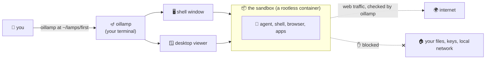

# 🪔 oillamp

**Give your AI coding agent its own Linux computer, with a desktop. It runs on your machine, but
it cannot reach your machine.**

AI coding agents do their best work when they can act like a programmer: install packages, run the
program, open a browser, look at the screen and click on things. Doing that on your own computer
puts your files, your SSH keys and your other projects within the agent's reach. A virtual machine
keeps them out of reach, but it is slow to set up and heavy to run.

oillamp sits in between. You run one command, and a few seconds later two windows open:

- 🖥️ a **terminal** logged into a sandboxed Linux system, and
- 🪟 a **viewer** showing that system's graphical desktop.

The agent working in there can install things, start Firefox, run GUI applications (Java Swing
included), take screenshots of its own screen and click on its own windows. It can reach the
internet. It **cannot** see your home directory, your keys, your other projects or your local
network. When you are done, one command removes the whole thing.



---

## 🚀 Quickstart

### What you need

- 🐧 **Linux** on a 64-bit Intel or AMD machine. Developed and tested on **Ubuntu 24.04**; other
  distributions should work but have not been tried.
- 🪟 **A graphical desktop session** (Wayland or X11), because oillamp opens windows.
- That's it. You do **not** need Java, Docker or root. If `podman` (the program that runs the
  sandbox) is missing, oillamp installs it for you and asks for your password once.

### 1. Get the program

oillamp is a single file of about 40 MB, with its own Java runtime inside. Build it once (this step
does need a JDK 25):

```sh
./gradlew singleFile
cp build/dist/oillamp ~/bin/      # or anywhere on your PATH
```

You can copy that file to any other Linux machine and run it there. Nothing gets installed.

### 2. Check your machine

```sh
oillamp doctor
```

This changes nothing. It lists **everything** that would stop a sandbox from starting (all at
once) and gives the exact command that fixes each one.

```
🪔 oillamp 0.1.0
[host]    ✓ Ubuntu 24.04.5 LTS, Wayland (ubuntu:GNOME)
[host]    ✓ podman 4.9.3, rootless, crun
[host]    ✓ this machine can run oillamp sandboxes
```

### 3. Start a sandbox 🔥

```sh
export EDENAI_API_KEY=...          # optional: the model key; oillamp keeps it, the sandbox never sees it
oillamp at ~/lamps/first
```

`~/lamps/first` is a directory you pick. oillamp creates it and keeps **everything** about this
sandbox inside it. oillamp calls such a directory a **lamp**.

⏳ The first start builds the sandbox image (about 3.5 GB: Debian, a JDK, Node.js, Python,
Firefox, a desktop and two agent harnesses) and takes several minutes. After that, starting takes
a few seconds.

Then the two windows open. The terminal you typed in stays where it is and shows the sandbox's
health until the session ends:

```
🪔 oillamp 0.1.0 — /home/you/lamps/first
[host]    ✓ Ubuntu 24.04.5 LTS, Wayland (ubuntu:GNOME)
[host]    ✓ podman 4.9.3, rootless, crun
[lamp]    ✓ config valid — network: default allow, 2 rules, no forwards
[lamp]    ✓ desktop 1920x1080, renderer gles2 (hardware)
[image]   ✓ sandbox image ready — localhost/oillamp/sandbox:0a6f7ffa4c89ca64
[session] ✓ sandbox running — container oillamp-v4elchzj
[session] ✓ desktop and shell both answering
[session] ✓ opened the desktop viewer
[session] ✓ opened your shell, in a new terminal window
```

### 4. Bring in a project and start the agent 🤖

The sandbox cannot see your files, and that is the point. In the sandbox shell, clone what you
want to work on and start a harness:

```sh
cd ~/workspace
git clone https://github.com/you/your-project.git
cd your-project
pi                     # or: opencode
```

The agent finds `~/AGENTS.md`, which explains the sandbox to it: what lasts between sessions, how
to drive the desktop, and why a request might be refused. It drives the desktop with a small
helper:

```sh
lamp screenshot                    # capture the screen, print the file's path
lamp click 960 540                 # click where a screenshot shows something
lamp type "hello"                  # type text
lamp key ctrl+shift+t              # press a key combination
lamp wait-stable                   # wait until the screen stops changing
```

### 5. Stop, and come back later 💤

Press **Ctrl-C** in the terminal you started from, close that terminal, or run
`oillamp stop ~/lamps/first` from anywhere.

Closing the shell window or the viewer does **not** end the session. Open new ones with
`oillamp shell ~/lamps/first` and `oillamp view ~/lamps/first` whenever you like.

The files stay on disk. `oillamp at ~/lamps/first` brings everything back, including what the
agent put in its home directory.

### 6. Delete it when you are done 🧹

```sh
oillamp remove ~/lamps/first           # shows what would be deleted, deletes nothing
oillamp remove ~/lamps/first --yes     # deletes it
```

Use this instead of `rm -rf`. Some files in a lamp belong to the sandbox's own internal user, and
your account is not allowed to delete them directly. `oillamp remove` knows how.

---

## 🧰 All the commands

```sh
oillamp at <dir>                 # start (or resume) a sandbox in <dir>
oillamp at <dir> --dry-run       # print every step it would take, and do nothing
oillamp doctor [<dir>]           # check this machine (and a lamp's config), change nothing
oillamp view <dir>               # open another desktop viewer
oillamp shell <dir>              # open another shell, in this terminal
oillamp status <dir>             # what a running session is doing
oillamp stop <dir>               # end a session from anywhere
oillamp list                     # every oillamp sandbox running on this machine
oillamp remove <dir>... [--yes]  # delete one or more lamps
oillamp recordings <dir>         # list screen recordings (if recording is on)
oillamp config <dir> check       # validate the lamp's oillamp.toml
oillamp guide                    # a first session, step by step, in your terminal
oillamp about                    # why oillamp exists and what it is built from
```

Add `--verbose` to any command to see every step as it happens. For tab completion:

```sh
eval "$(oillamp completion bash)"                        # this shell only
echo 'eval "$(oillamp completion bash)"' >> ~/.bashrc    # every future shell
```

---

## ⚙️ Configuring a lamp

Every lamp has an `oillamp.toml`, created with every setting present and explained in comments.
The agent cannot see or change this file. A few highlights:

```toml
[display]
width  = 1920
height = 1080
gpu    = "auto"              # use your graphics card if possible, fall back if not

[recording]
enabled = false              # true records the whole desktop session to a video file

[image]
extra_apt_packages = []      # system packages to bake into the sandbox image

[network]
default = "allow"            # what happens when no rule matches

[[network.rules]]            # rules are checked top to bottom, first match wins
label  = "company artifact mirror"
action = "allow"
hosts  = ["nexus.corp.example.com"]
```

The shipped rules block your local network and this machine's loopback, and send Eden AI traffic
only to its EU endpoint. When the agent hits a blocked address, it gets a clear refusal naming the
rule, and you see the refusal in your terminal.

Edit, check with `oillamp config <dir> check`, and restart the session to apply. An optional
`~/.config/oillamp/config.toml` sets defaults for all your lamps.

---

## 🛡️ What it protects, and what it doesn't

oillamp is built to keep an agent away from **your computer**. It is not built to stop an agent
from talking to the internet.

✅ **Protected:**
- Your home directory, SSH keys and other projects: the sandbox cannot see them.
- Your local network and the services on your machine: the sandbox has no network of its own,
  and every connection goes through a policy check in oillamp.
- The desktop, the screen recording and the network connections: they run as a separate user
  the agent cannot touch.
- Your system: nothing in the sandbox runs as root on your machine.

⚠️ **Not protected:**
- **The agent runs as you**, inside the container. What keeps it away from your files is what
  the container can see, not file permissions. A kernel flaw, or a wrongly attached directory,
  would give it your rights (never root's).
- **It is a container, not a virtual machine.** Your kernel is shared with the sandbox.
- **The internet is open by default.** Data the agent can read, it can send. That is why the model
  key is not in the sandbox: oillamp adds it to model requests on their way out.
- **Your machine's own public addresses are not blocked.** If a service on your machine listens
  on every address (`0.0.0.0`), add a deny rule for your addresses, or bind it to `127.0.0.1`.
- **Disk space has no limit.** An agent that downloads without end can fill your disk.

---

## 📚 Learn more

| I want to… | Read |
|---|---|
| understand the tools oillamp is built from (containers, podman, uid maps, Wayland, VNC, Java…) | [docs/TECH-STACK.md](docs/TECH-STACK.md) |
| understand how oillamp works inside: startup order, moving parts, where state lives | [docs/ARCHITECTURE.md](docs/ARCHITECTURE.md) |
| know why it was built this way | [docs/DECISIONS.md](docs/DECISIONS.md) |
| know what is verified, and what is still missing | [docs/STATUS.md](docs/STATUS.md) |
| build, test and change oillamp | [CONTRIBUTING.md](CONTRIBUTING.md) |

---

*Version 0.1.0. Everything planned for the first version works on Ubuntu 24.04, apart from a
proxy setting for Firefox and configuring the agent harnesses for a company LLM. See
[docs/STATUS.md](docs/STATUS.md) for details.*
