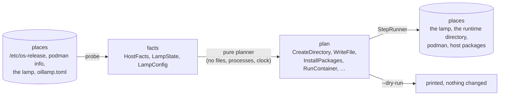
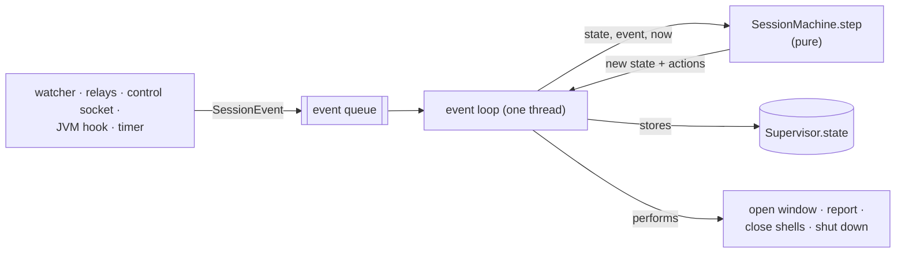
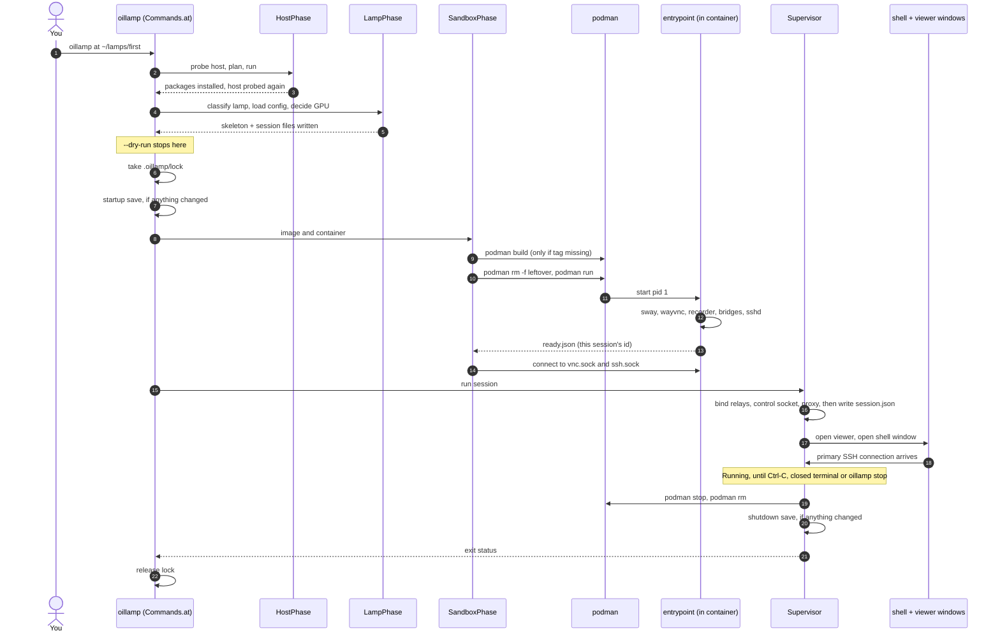
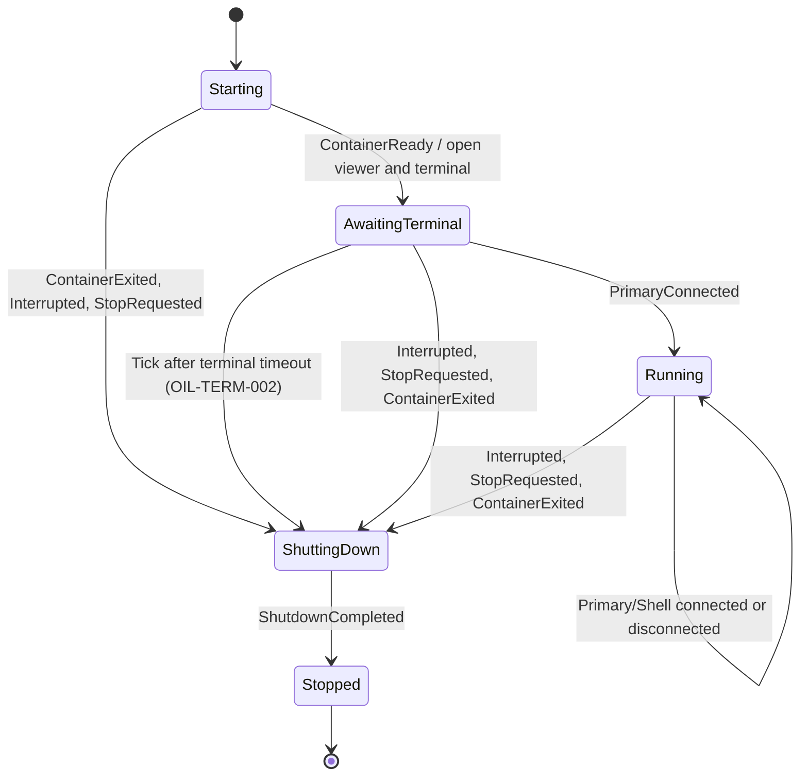
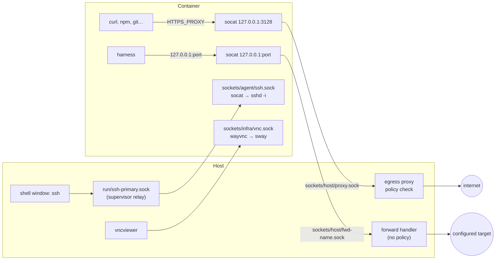

# How oillamp works

This document describes the running application: its moving parts, where its state lives, what
happens in which order, and how each tool is configured. It is for the people who maintain
oillamp.

It assumes you know what the tools are: containers, rootless podman, uid maps, Unix sockets,
Wayland, VNC. If you don't, read [TECH-STACK.md](TECH-STACK.md) first. The reasons behind the
design are in [DECISIONS.md](DECISIONS.md), and what has been verified and what is missing is in
[STATUS.md](STATUS.md).

File names without a directory are in `src/main/java/dev/oillamp/`. Image files are under
`src/main/resources/image/`.

---

## Contents

1. [Vocabulary](#vocabulary)
2. [The moving parts](#the-moving-parts)
3. [Where state lives](#where-state-lives)
4. [How oillamp changes state](#how-oillamp-changes-state)
5. [What happens when you run `oillamp at`](#what-happens-when-you-run-oillamp-at)
6. [The container](#the-container)
7. [The running session](#the-running-session)
8. [The network](#the-network)
9. [Desktop, viewer, recording and GPU](#desktop-viewer-recording-and-gpu)
10. [How each tool is configured](#how-each-tool-is-configured)
11. [How the Java code is organised](#how-the-java-code-is-organised)
12. [Packaging](#packaging)
13. [Configuration reference](#configuration-reference)
14. [Problem codes and exit codes](#problem-codes-and-exit-codes)

---

## Vocabulary

These words have one meaning each, in the code and in the documents.

| Word | Meaning |
|---|---|
| **host** | The computer oillamp runs on: your laptop. |
| **sandbox** | The container oillamp starts for the agent. "Container" and "sandbox" mean the same thing here. |
| **lamp** | One directory on the host that holds everything about one sandbox: configuration, state and the agent's files. You pick the path. |
| **agent id** | Eight random characters from `a`–`z` and `2`–`7`, made when a lamp is created and never changed. The container name, hostname and some directory names come from it. Example: `v4elchzj`. |
| **agent directory** | `<lamp>/agent-lamp-<agent id>/`, attached to the container as `/home/agent`. The only part of the lamp the agent can change freely. |
| **state directory** | `<lamp>/.oillamp/`: oillamp's own files (identity, keys, sockets, recordings, logs). |
| **agent user** | The container user `agent`, uid 1000. It is *your* user on the host. Runs the shell and everything the agent starts. |
| **infra user** | The container user `lamp`, uid 1001. On the host it is a subordinate id that owns nothing. Runs the compositor, the VNC server, the recorder and the network bridges. |
| **session** | One run of `oillamp at`, from start to shutdown. Its **session id** is the UTC start time, such as `20260923-085055`. |
| **supervisor** | The `oillamp at` process while a session runs. It stays in the foreground of the terminal you started it in. |
| **primary shell** | The SSH connection from the terminal window oillamp opens. When it connects, the session is up. |
| **extra shell** | A shell opened with `oillamp shell <dir>`. |
| **relay** | A Unix socket on the host that forwards each connection into a socket inside the sandbox. Used for SSH. |
| **control socket** | A Unix socket the supervisor listens on, so that `oillamp stop`, `status`, `view` and `shell` can talk to a running session. |
| **egress proxy** | The HTTP proxy inside oillamp that is the sandbox's only way out. "Egress" means outbound. |
| **forward** | A fixed tunnel from a port inside the sandbox to one address you configured. Not subject to the proxy's rules. |
| **runtime directory** | `$XDG_RUNTIME_DIR/oillamp/<agent id>/`, usually `/run/user/<uid>/oillamp/<agent id>/`. Short socket paths, in memory. |
| **phase** | One stage of starting up: host, lamp, image and sandbox, session. |
| **plan**, **step** | A step describes one change oillamp intends to make, such as "create this directory with mode 0700". A plan is a list of steps. |
| **problem** | oillamp's structured error: a code, what happened, why it matters, evidence, and fixes. |
| **spike** | A test that runs real podman to confirm an assumption about a third-party tool. |
| **snapshot** | The agent directory and `oillamp.toml` as they were at one moment, kept in the lamp's history. One git commit. |
| **history** | `<lamp>/.oillamp/history/`: a git repository holding a lamp's snapshots, oldest to newest on one branch. |
| **harness** | The agent program a session holds and prompts: pi, in RPC mode, started over ssh by the supervisor. One per session. |
| **run** | One time the harness is woken with a prompt, by a job or by `oillamp ask`. Named `run-<n>`, counted per lamp. |
| **job** | An entry on a lamp's schedule: a prompt, and a cron expression or a single time. Named `job-<n>`. Added by the user or by the agent. |
| **schedule** | `<lamp>/.oillamp/schedule.json`: a lamp's jobs. Jobs only run while a session runs, and only with `schedule.enabled` on or the session started with `--enable-scheduling`. |

---

## The moving parts

oillamp is a Java program, a handful of shell scripts, and about twenty third-party tools. This
table lists every part that runs, what it is written in, where it runs and as whom.

| Part | Kind | Runs where, as whom | Job |
|---|---|---|---|
| `oillamp` launcher (`src/packaging/launcher.sh`) | POSIX shell | host, you | Unpacks the bundled Java runtime once, then `exec`s it. |
| oillamp (`dev.oillamp`) | Java 25 | host, you | Checks the host, prepares the lamp, builds the image, starts the container, supervises the session, **is** the network proxy. |
| `podman`, `crun` | third-party | host, you | Build the image, run the container, `podman unshare` for infra-owned files. |
| `apt-get`, `usermod` via `sudo` | third-party | host, root | Install missing host packages and add subordinate ids. Only with your consent. |
| `ssh-keygen` | third-party | host, you | Makes the lamp's client and host keys. |
| your terminal emulator + `ssh` + `socat` | third-party | host, you | The shell window. `ssh` reaches the sandbox through `socat` and a Unix socket. |
| `vncviewer` (TigerVNC) | third-party | host, you | The desktop viewer window. |
| `entrypoint` (`rootfs/usr/local/lib/oillamp/`) | bash | container, root (pid 1) | Prepares the container, starts every process below with no capabilities, reports ready, watches them, stops them. |
| `sway` + `Xwayland` | third-party | container, infra user | The headless desktop, with X11 on display `:0`. |
| `swaybg` | third-party | container, infra user | Draws the wallpaper. |
| `wayvnc` | third-party | container, infra user | Serves the desktop over VNC on a Unix socket. |
| `wf-recorder` | third-party | container, infra user | Records the desktop, if recording is on. |
| `socat` bridges | third-party | container, infra user | `127.0.0.1:3128` → proxy socket, and one per forward. |
| `socat` + `sshd -i` | third-party | container, agent user | The SSH listener; one `sshd` per connection. |
| `dbus-daemon` | third-party | container, agent user | The session bus GUI applications expect. |
| `/etc/profile.d/oillamp.sh` | bash | container, agent user | The environment of every shell: proxy, display, library paths, SDKMAN, prompt, banner. |
| `lamp` (`rootfs/usr/local/bin/`) | bash | container, agent user | The desktop helper: screenshot, click, type, key, wait-stable. |
| `lamp-pointer` (`rootfs/usr/local/lib/oillamp/`) | Python 3, standard library | container, agent user | Sends mouse events through the VNC socket for `lamp click` and friends. |
| `install-*.sh`, `write-opencode-config.mjs` (`build/`) | bash, Node.js | container, root, **while the image is built** | Install Node.js, SDKMAN, pi, opencode, and write opencode's config. |
| pi, opencode, Firefox, the JDK, … | third-party | container, agent user | What the agent uses. oillamp never starts these itself. |

And the whole picture, while a session runs:

```mermaid
flowchart LR
    subgraph HOST["Host (your desktop session)"]
        direction TB
        launch["launching terminal"]
        subgraph SUP["oillamp supervisor (Java)"]
            direction TB
            loop["event loop + SessionMachine"]
            relays["SSH relays<br/>run/ssh-primary.sock<br/>run/ssh.sock"]
            control["control socket<br/>run/control.sock"]
            egress["egress proxy<br/>sockets/host/proxy.sock<br/>sockets/host/fwd-*.sock"]
            watch["sandbox watcher"]
        end
        termwin["shell window<br/>ssh + socat"]
        viewer["viewer window<br/>vncviewer"]
        other["oillamp stop / status /<br/>view / shell"]
    end
    subgraph C["Container oillamp-(id) · no network · read-only"]
        direction TB
        ep["entrypoint (pid 1, root)"]
        subgraph INFRA["as infra user"]
            sway["sway + Xwayland"]
            wayvnc["wayvnc<br/>sockets/infra/vnc.sock"]
            rec["wf-recorder"]
            bridge["socat 127.0.0.1:3128"]
        end
        subgraph AGENT["as agent user"]
            sshd["socat sockets/agent/ssh.sock<br/>→ sshd -i → bash"]
            apps["harness, browser, GUI apps"]
        end
    end
    launch --- SUP
    termwin -->|ssh| relays -->|ssh.sock| sshd
    viewer -->|vnc.sock| wayvnc --> sway
    apps -->|Wayland / X11| sway
    apps -->|HTTP_PROXY| bridge -->|proxy.sock| egress --> internet(("internet"))
    other --> control
    watch -.->|podman inspect,<br/>connect to sockets| C
    ep -.->|starts, watches| INFRA
    ep -.->|starts| AGENT
```



Every arrow that crosses between host and container is a Unix domain socket in a bind-mounted
directory. There is no TCP port on the host and no network interface in the container.

---

## Where state lives

oillamp decides with **values** (immutable records, persistent collections, no `null`) and keeps
its state in a small number of **places**. A value never changes; a place is somewhere whose
content changes over time: a file, a socket, a container, a field. Every place has one job and a
known lifetime:

| Place | Written by | Read by | Lifetime |
|---|---|---|---|
| `<lamp>/oillamp.toml` | you; created from a template if missing | every command that reads configuration | until `oillamp remove` |
| `<lamp>/.oillamp/lamp.json` | `LampPlanner` (identity); `Supervisor` (`lastSessionAt`) | every command that names the lamp | until `oillamp remove` |
| `<lamp>/.oillamp/lock` | `LampLock`; the kernel holds the lock | `Commands.at` | the lock ends with the process, however it ends |
| `<lamp>/.oillamp/session.json` | `Supervisor`, after its sockets are bound | `Commands.at` on a busy lamp | deleted at shutdown; a killed supervisor leaves it |
| `<lamp>/.oillamp/keys/`, `ssh_config`, `known_hosts` | `LampPlanner` (keys once, the rest every start) | the shell window, `oillamp shell` | until `oillamp remove` |
| `<lamp>/.oillamp/session/` | `LampPlanner.planSession`, every start | the entrypoint, sshd, every shell | rewritten each session |
| `<lamp>/.oillamp/image/context/` | `ImageResources`, before a build | `podman build` | overwritten at the next build |
| `<lamp>/.oillamp/sockets/*/` | the proxy (host); wayvnc and the ssh listener (container) | relays, viewer, socat | files outlive their servers; deleted before the next session |
| `<lamp>/.oillamp/recordings/` | wf-recorder | you, the agent (read only) | until retention deletes them |
| `<lamp>/.oillamp/logs/network-<session>.jsonl` | the egress proxy | you | until you delete them |
| `<lamp>/.oillamp/history/` | `History`: at the start and end of every session, `oillamp save`, `oillamp restore` | `oillamp history`, `oillamp restore`, git by hand | until `oillamp remove`; only ever grows |
| `<lamp>/.oillamp/schedule.json` | `ScheduleBook`, for `oillamp schedule`, for the session as runs start, and for the agent's requests | `oillamp schedule`, the session every 30 s | until `oillamp remove` |
| `<lamp>/.oillamp/schedule.lock` | `ScheduleBook`; held for the moment one change takes | every other change | the lock ends with the process |
| `<lamp>/.oillamp/history.lock` | `History`; the kernel holds the lock while one save or restore runs | every other save and restore, which wait for it | the lock ends with the process |
| `<lamp>/agent-lamp-<id>/` | the agent; `LampPlanner` writes `AGENTS.md`, `.bashrc` and, with the schedule on, `.pi/agent/extensions/oillamp-schedule.js` | the agent, you | until `oillamp remove` |
| `$XDG_RUNTIME_DIR/oillamp/<id>/sockets` (a symlink) | `LampPlanner.planSkeleton`, every start | every host-side socket path | in memory: gone at reboot, made again next start |
| `$XDG_RUNTIME_DIR/oillamp/<id>/run/*.sock` | `Supervisor` (relays, control socket) | `oillamp stop/status/view/shell`, the shell window | deleted at shutdown; a killed supervisor leaves them |
| `~/.config/oillamp/config.toml` | you (optional) | every command that reads configuration | until you delete it |
| `~/.cache/oillamp/<version>-<fingerprint>/` | the launcher, on first run | the launcher | until you delete it |
| podman: image `localhost/oillamp/sandbox:<tag>` | `podman build` | `podman run` | until removed by hand |
| podman: container `oillamp-<id>` and its labels | `podman run` | `list`, `remove`, `stop`, the sandbox watcher | removed at shutdown; a killed supervisor leaves it running |
| `/run`, `/tmp` in the container | the entrypoint and its processes | the container's processes | until the container stops |
| `Supervisor.state` (in memory) | the event loop only | the watcher, the control socket, the shutdown thread, the JVM hook | until the process exits |
| the launching terminal | `ConsoleRenderer` | you | the only record of a session; no session log is written |

Two things surprise people. Part of a lamp's state is **outside the lamp**, in the runtime
directory, so that nothing attached to the container can reach it. And the supervisor writes **no
session log**: what it reports exists only in the terminal it runs in, apart from the network log.

### The lamp directory on disk

```
<lamp>/
├── oillamp.toml                 your configuration                      you, 0600
├── README.txt                   a note to whoever finds this directory  you, 0644
├── .oillamp/                    oillamp's state                          you, 0700
│   ├── lamp.json                identity: schema version, agent id, dates
│   ├── lock                     locked by the supervisor while a session runs
│   ├── session.json             present while a session runs (informational)
│   ├── keys/                    client_ed25519(.pub), host_ed25519(.pub)  0700
│   ├── ssh_config               used by the shell window and `oillamp shell`
│   ├── known_hosts              pins the sandbox's host key
│   ├── session/                 rewritten each session; attached read-only at /oillamp/session
│   │   ├── runtime.env          settings the entrypoint and every shell read
│   │   ├── authorized_keys      the client public key
│   │   ├── ssh_host_ed25519_key a copy of the host key for sshd (0600)
│   │   ├── agent-guide.md       the same text as ~/AGENTS.md
│   │   └── gitconfig            the name and email on the agent's commits
│   ├── image/context/           the image build files, extracted from the jar before a build
│   ├── sockets/                 not attached itself; each directory below is, on its own
│   │   ├── host/                you;        proxy.sock, model.sock, fwd-*.sock, schedule.sock;
│   │   │                        read-only in the container
│   │   ├── infra/               infra user; vnc.sock, ready.json
│   │   └── agent/               you;        ssh.sock
│   ├── recordings/              infra user; <session>.mkv; attached at /oillamp/recordings
│   ├── logs/                    network-<session>.jsonl
│   ├── history/                 the lamp's snapshots, a bare git repository; never attached
│   ├── history.lock             locked while a save or a restore runs
│   ├── schedule.json            the jobs that wake the agent; never attached
│   └── schedule.lock            locked while the schedule is changed
└── agent-lamp-<agent id>/       attached read-write at /home/agent
    ├── AGENTS.md                rewritten each session
    ├── .bashrc                  written once, then left alone
    ├── .pi/agent/extensions/oillamp-schedule.js
    │                            the scheduling tools; written each session while the schedule is on
    ├── workspace/
    │   └── NOTES.md             the agent's notes between runs, written by the agent
    ├── libs/                    on LD_LIBRARY_PATH, and so on java.library.path
    └── screenshots/
```

The paths come from `LampLayout`. Why it is laid out like this:

- **`oillamp.toml` is outside the agent directory.** It holds the network policy, and the agent
  must not be able to change the rules that restrict it. Keys and logs are outside for the same
  reason.
- **`.oillamp/` is mode 0700**, so no other user on the host can reach the sockets inside it. That
  lets the proxy socket itself be 0666, so the infra user's socat can connect.
- **`sockets/infra/` and `recordings/` belong to the infra user.** `LampPlanner` hands them over
  with `podman unshare chown 1001:1001`. The agent (uid 1000, no capabilities) cannot write,
  delete or replace anything there. It can *read* recordings, on purpose: you need to read them,
  and to the infra user you and the agent are the same kind of outsider.
- **A lamp cannot be deleted with `rm -rf`**, because those infra-owned files belong to a
  subordinate id. `oillamp remove` deletes them with `podman unshare rm -rf`.
- The name **`agent-lamp-<id>`** means a copied agent directory is never mistaken for a lamp.

### The history

A lamp keeps snapshots of itself in `.oillamp/history/`, a git repository. A snapshot is one
commit, and its tree mirrors the lamp:

```
agent-lamp-<agent id>/     the whole agent directory, nested .git directories included
oillamp.toml
.oillamp-modes             the exact permissions git cannot hold
```

The container's root filesystem is read-only and made new each session, so the agent directory is
everything the sandbox keeps. `.oillamp/` is left out: it holds keys, sockets and logs, and some of
it belongs to the infra user, which the host user cannot even read.

**How it is written.** `History` writes git's objects itself; it does not run `git`. That is for
two reasons. `git add` stores a directory that contains its own `.git` as a bare pointer to a
commit and leaves out its files. `git checkout` and `git archive` refuse any path through `.git`.
The agent clones projects into its home, so with git's own commands a restore would lose exactly
the work it is for. The object format is simple, and `GitFormat` holds all of it as pure functions:

- a **blob** is one file's content, and is compressed with zlib into
  `objects/<first 2 hex digits>/<other 38>`, named by the SHA-1 of its content;
- a **tree** is one directory: sorted names, each with a mode (file, executable, link or
  directory) and the name of a blob or tree;
- a **commit** names the top tree and the commit before it, and holds a message.

git itself still reads the result: `git --git-dir=<lamp>/.oillamp/history log` lists the snapshots.
git only knows "executable or not", so the other permissions, such as 0600 on a private key or 0555
on a read-only directory, go in `.oillamp-modes`: one `<octal> <path>` per path that differs from
git's defaults (0644, 0755 for executables and directories), each ended by a NUL byte, because a
name may contain a line break.

**Saving** walks the agent directory without following links, stores each file that is not stored
yet, builds the trees, and compares the top tree with the newest commit's. If they are equal,
nothing changed and no commit is made. Otherwise it writes a commit and moves `refs/heads/main` to
it, last. Every object goes to a temporary file first and is renamed into place, so a save that
is cut short leaves the history as it was, plus some objects nothing refers to. Unreadable files
are left out and reported (`OIL-HISTORY-004`). So are files that keep changing while they are read.
Sockets, pipes and devices are skipped without a word.

**Restoring** takes the lamp's lock (so no session can run), saves first (a "safety save"), then
compares the target snapshot's trees with the safety save's, directory by directory. A directory
whose tree is the same in both is skipped whole, which is why restoring a large home takes about a
second. Everything else is deleted and rewritten, then the permissions from `.oillamp-modes` are
applied, directories last and deepest first. Finally a commit records the restore, with the
target's tree. Nothing is ever removed from the history.

**What made each snapshot** is in its commit message:

```
startup save

Oillamp-Save: startup
Oillamp-Session: 20260929-181200
```

| Kind | Made by |
|---|---|
| `startup` | `Commands.at`, after taking the lock and before the sandbox starts |
| `shutdown` | `Supervisor.shutDown`, after the container is removed; also after Ctrl-C |
| `running` | `oillamp save` while a session runs; a program may have been writing |
| `idle` | `oillamp save` while no session runs |
| `before-restore` | `oillamp restore`, just before it changes anything |
| `restore` | `oillamp restore`, recording which snapshot it went back to |
| `before-run` | `Runs`, just before the agent is woken, if anything changed since the last snapshot |
| `run` | `Runs`, as a run ends, always, even when nothing changed: its message holds the agent's last message |

A run's snapshots carry more trailers: `Oillamp-Run` (`run-12`), and on the `run` snapshot
`Oillamp-Job`, `Oillamp-Author` (`user` or `agent`: who added the job), `Oillamp-Outcome`
(`finished`, `failed`, `timed out`, `interrupted`, `cancelled`), `Oillamp-Conversation` (the id of
the pi conversation the run had, when it got that far) and `Oillamp-Base` (the snapshot the lamp was
in as the run began, so that what the run changed can be listed). `LampEvent.Snapshot` carries the
job, outcome and conversation, so an application can list past runs from `history`. Trailers are read only from a
message's last paragraph, and only when every line in it is one: the agent's own words are in the
message, and a line in them that looks like a trailer must not count.

oillamp reads only what it writes: one file per object. `git gc` would pack them into a single
file, which oillamp cannot read, so the repository's config sets `gc.auto = 0` to keep git from
doing that by itself.

### Why sockets have two paths

Linux limits a Unix socket path to 107 bytes, and a lamp can be anywhere. So every socket the host
binds or connects to is addressed through the short runtime directory:

```
$XDG_RUNTIME_DIR/oillamp/<agent id>/
├── sockets -> <lamp>/.oillamp/sockets    a symlink
└── run/                                  host-only sockets, never attached to the container
    ├── control.sock
    ├── ssh-primary.sock
    └── ssh.sock
```

The `run/` sockets are outside the lamp on purpose: the container cannot see them, so the agent
cannot take the primary SSH slot or send commands to the supervisor.

### `lamp.json`

```json
{
  "schemaVersion": 1,
  "agentId": "v4elchzj",
  "createdAt": "2026-09-22T14:15:03Z",
  "createdBy": "oillamp 0.2.0",
  "lastSessionAt": "2026-09-22T16:40:10Z"
}
```

A lamp with a higher `schemaVersion` than this build understands is refused (`OIL-LAMP-004`).
There is no migration code yet, because there has only been version 1.

---

## How oillamp changes state

There are exactly two ways oillamp changes a place, and both keep deciding apart from doing.

### While starting: probe, plan, run

Each startup phase reads places into a record of **facts**, turns the facts into a **plan** with a
pure function, and hands the plan to `StepRunner`, the only class that carries out steps.



Because a plan is data, `--dry-run` prints the real plan, not a separate preview that could drift
from what really happens. `StepRunner` skips a step that is already done (a file written "only if
absent" that exists, a key that exists) and reports it as skipped, and it stops at the first
failed step.

### While running: events, one state machine, one writer

During a session, everything that happens becomes an **event** value on one queue: a shell
connecting, the container stopping, Ctrl-C, `oillamp stop`, or a `Tick` every second. One thread
takes events one at a time and calls `SessionMachine.step(state, event, now)`, a pure function that
returns the next state and a list of **actions**. The supervisor stores the state in its one field
and performs the actions.



The one place that changes during a session has exactly one writer.

### Three rules that follow

- **Ask the place that knows.** oillamp does not keep copies of facts that live elsewhere:

  | Question | Answered by |
  |---|---|
  | Is a session running on this lamp? | the lock on `.oillamp/lock`, not `session.json` |
  | Which sandboxes are running? | podman, by container label; oillamp keeps no list |
  | Is the image up to date? | whether podman has the tag computed from today's inputs |
  | Is the desktop up? | connecting to its socket, not checking the file exists |
  | What is the session doing? | the supervisor, through its control socket |

- **Clean up at the next start, not only at the last stop.** A process can die without running
  its shutdown. So every start deletes stale socket files and `ready.json`, removes a leftover
  container with the lamp's name, and removes a stale `session.json`. `oillamp stop` does the same
  for a supervisor that died.
- **One id, many names.** The container name, runtime directory and ssh alias all come from the
  agent id, and nothing checks the id is unique. A lamp copied with `cp -a` has the same id as the
  original, so starting both at once would remove the original's container as "left over". This
  is an open question in STATUS.md.

---

## What happens when you run `oillamp at`



The same, step by step:

1. **`OilLamp.main`** builds a real `Machine` and calls `OilLamp.run(argv)`. `run` catches any
   unexpected exception and reports it as `OIL-INTERNAL-001`, so you never see a raw stack trace.
2. **`Invocation.execute`** parses the command line by hand (no library) and calls the matching
   method on `Commands`. Every usage mistake exits with code 2.
3. **Host phase (`HostPhase`).**
   - `HostProbe.probe` collects `HostFacts`: the distribution, your user and groups, the graphical
     session, which required packages are installed, your subordinate id ranges, podman's version
     and runtime, whether `podman unshare true` works, terminal emulators on `PATH`, GPU render
     nodes, CPU count, sudo, and the filesystem type of the lamp path.
   - `HostPlanner.plan` turns the facts into steps (install packages, add a subordinate id range,
     `podman system migrate`) or problems.
   - After running the steps, the host is **probed again** and planned again in strict mode. The
     first probe ran before podman existed, so its answers about podman meant nothing.
4. **Lamp phase (`LampPhase`).**
   - Resolves the path (following symlinks) and refuses dangerous ones (`LampPaths`): `/`, your
     home directory itself, system directories such as `/etc`.
   - Refuses network and FAT filesystems, which cannot hold Unix sockets.
   - `LampClassifier` decides what the directory is: missing, empty, an existing lamp, someone
     else's files, or damaged.
   - Loads the configuration (`ConfigLoader`), decides on the GPU (`Gpu.decide`) and prints a
     summary.
   - `LampPlanner.planSkeleton` plans the directory tree, identity file, SSH keys, ownership
     changes, recording retention and the runtime directory. `StepRunner` runs it.
   - `LampPlanner.planSession` then plans the per-session files: `runtime.env`, the agent guide,
     the agent's git identity (`GitConfig`), `authorized_keys`, `ssh_config`, `known_hosts`. It is a second plan because it needs the
     public keys the first one generated.
5. **`--dry-run` stops here**, after also planning the image and container steps, so the full
   `podman run` command is printed. A dry run takes no lock and changes nothing.
6. **Lock.** `LampLock.tryAcquire` takes an exclusive OS file lock on `.oillamp/lock`. If another
   session holds it, oillamp reports `OIL-LOCK-001` and exits with code 4. The OS releases the lock
   when the process dies, however it dies.
   Then the lamp is saved, if anything changed since its last snapshot (a startup save). A save
   that fails is a warning, and the session starts anyway.
7. **Image and sandbox phase (`SandboxPhase`).**
   - Computes the image tag. If podman does not have it, extracts the image files from the jar and
     runs `podman build`, showing its output on the activity line.
   - Removes a leftover container with the same name, deletes the previous session's socket files,
     runs `podman run`, waits for `ready.json` carrying **this** session's id, then connects to
     the VNC and SSH sockets to prove they answer.
8. **Supervisor (`Supervisor.run`)** binds the relays, the control socket and the egress proxy,
   writes `session.json`, opens the two windows, and waits until the session ends. On the way out
   it runs the shutdown sequence. `Commands.at` then releases the lock.

Until the supervisor is up, `Commands.at` holds a JVM shutdown hook of its own: a Ctrl-C while the
image builds, or a start that fails, removes the container this run started. The supervisor's hook
replaces it once the session is up.

The other commands reuse these parts. `doctor` runs the host phase as a dry run with installing
forbidden. `view`, `shell`, `stop` and `status` send one request to the control socket. `remove`
and `recordings --prune` build a plan and run it with `StepRunner`. `list` asks podman for
containers labelled `oillamp.agent-id`. `save`, `history` and `restore` use `History` directly
and talk to no session; `save` and `restore` try the lamp's lock only to find out whether a
session is running.

---

## The container

### The image

Everything that goes into the image is under `src/main/resources/image/`:

| Path | Kind | Purpose |
|---|---|---|
| `Containerfile` | build recipe | Debian 13 "trixie", everyday shell tools, the desktop stack, developer tools (JDK, Node.js, Python, Firefox), the two users, then the files from `rootfs/`. |
| `build/install-node.sh` | bash | Installs Node.js from NodeSource (Debian's is too old for the harnesses). |
| `build/install-sdkman.sh` | bash | Installs SDKMAN into `/usr/local/share/oillamp/sdkman`, with its questions turned off. |
| `build/install-agent-tools.sh` | bash | Installs `opencode` and `pi` with npm, and pi's Eden AI extension into `/usr/local/share/oillamp/pi`. Never fails the build. |
| `build/write-opencode-config.mjs` | Node.js | Writes `/usr/local/share/oillamp/opencode/opencode.json`: Eden AI through its EU endpoint, with the models that endpoint lists. |
| `rootfs/usr/local/lib/oillamp/entrypoint` | bash | The container's first process. |
| `rootfs/usr/local/lib/oillamp/lamp-pointer` | Python | Mouse input through VNC, for `lamp`. |
| `rootfs/usr/local/bin/lamp` | bash | The agent's desktop helper. |
| `rootfs/etc/profile.d/oillamp.sh` | bash | The environment of every shell, including the harnesses' model address and placeholder key. |
| `rootfs/etc/oillamp/sshd_config` | config | sshd: key login only, every kind of forwarding off. |
| `rootfs/etc/oillamp/sway/config` | config | The compositor: includes, window frames, no key binding that runs a command. |
| `rootfs/etc/xdg/foot/foot.ini` | config | The in-sandbox terminal's font and colours. |
| `rootfs/etc/ssh/ssh_config.d/50-oillamp-proxy.conf` | config | Sends outbound SSH (`git@github.com:…`) through the egress proxy. |
| `rootfs/usr/share/oillamp/wallpaper.svg`, `.png` | image | The desktop background. After editing the SVG, render it with `inkscape wallpaper.svg --export-type=png --export-filename=wallpaper.png`. |

At build time Gradle writes a `MANIFEST` listing every file with its mode (`755` or `644`), so that
`ImageResources` can find the files inside the jar and extract them with the right permissions. An
entrypoint extracted without its executable bit would make the container die at once.

**The image tag is a hash of its inputs.** `ImageResources.hashOf` computes SHA-256 over every
image file (path, mode and contents) and every build argument (`BASE_IMAGE`, `JDK_PACKAGE`,
`NODE_MAJOR`, `EXTRA_APT_PACKAGES`, `AGENT_TOOLS`). The tag is
`localhost/oillamp/sandbox:<first 16 hex digits>`. Lamps with identical inputs share an image.
Old images are never removed; see STATUS.md.

The Containerfile has a `WITH_TOOLCHAIN` argument (default `true`). When `false`, the JDK, browser,
Node.js and agent tools are skipped. oillamp always builds with the default; the spikes use `false`
to build faster. At the end of the build, the setuid and setgid bits are removed from every file.

### The `podman run` command

`SandboxPhase.containerArgv` builds it; `oillamp at <dir> --dry-run --verbose` prints it.

```
podman run --detach --name oillamp-<id>
    --network=none                         no network interface except loopback
    --read-only                            the image's filesystem cannot be changed
    --user 0:0                             start as container root (the entrypoint needs it)
    --userns=keep-id:uid=1000,gid=1000     your user becomes container uid 1000
    --tmpfs /run:rw,mode=755               writable scratch space in memory
    --tmpfs /tmp:rw,mode=1777
    --memory 16g --cpus <n> --pids-limit 8192
    --label oillamp.agent-id=<id> --label oillamp.lamp=<lamp path> --label oillamp.session=<session>
    --volume <lamp>/.oillamp/session:/oillamp/session:ro
    --volume <lamp>/.oillamp/sockets/host:/oillamp/sockets/host:ro
    --volume <lamp>/.oillamp/sockets/agent:/oillamp/sockets/agent
    --volume <lamp>/.oillamp/sockets/infra:/oillamp/sockets/infra
    --volume <lamp>/.oillamp/recordings:/oillamp/recordings
    --volume <lamp>/agent-lamp-<id>:/home/agent
    [--device /dev/dri/renderD128 --group-add keep-groups]    only when the GPU is used
    localhost/oillamp/sandbox:<tag>
```

- **The three socket directories are attached one by one, never their parent.** The agent runs as
  your uid, and `sockets/` belongs to you. If the parent were attached, the agent could move the
  infra user's `infra/` aside and serve its own desktop to your viewer. A directory that is itself
  a mount point cannot be moved from inside. `oillamp at` also refuses a lamp in which one of
  these directories is a symbolic link. `host/` is read-only because the sandbox only connects to
  the sockets in it.
- **Capabilities are not dropped by a podman flag.** Container root keeps podman's default set, to
  create directories and switch users. The entrypoint starts every long-running process with
  `setpriv --inh-caps=-all --ambient-caps=-all --bounding-set=-all`.
- **There is no `--init` and no `no-new-privileges`.** The entrypoint is process 1. Instead of
  `no-new-privileges`, the image has no setuid programs.
- **The labels** let `list`, `stop` and `remove` find containers without a registry of their own.
  `oillamp.lamp` lets `remove` find a running container even when `lamp.json` is already gone.

### The entrypoint, step by step

`/usr/local/lib/oillamp/entrypoint` is a bash script running as container root:

1. Reads `/oillamp/session/runtime.env` and checks the required settings. Missing settings stop the
   container with exit code 70.
2. Deletes `vnc.sock`, `ready.json` and `ssh.sock` from the previous session. The socket directories
   outlive the container, and wayvnc cannot bind a path that already exists.
3. Creates `/run/lamp` (infra user, 0711), `/run/lamp/private` (0700), `/run/agent` (agent, 0700)
   and cache directories. Writes sway's screen size to `/run/lamp/output.conf` and the window
   layout to `/run/lamp/windows.conf`. Creates `/tmp/.X11-unix` as root with mode 1777.
4. Copies pi's configuration and SDKMAN from `/usr/local/share/oillamp/` into the agent's home, as
   the agent user, never over anything already there. Failure never stops the container.
5. Starts **sway** as the infra user and waits up to 20 s for `/run/lamp/wayland-1`. If the GPU
   renderer (`gles2`) fails, it retries once with `pixman` and records `gpu_fallback: true`.
6. Makes the Wayland socket connectable (0666) so the agent's applications can draw; sway's control
   socket stays 0700. Opens X11 display `:0` to the agent: makes `/tmp/.X11-unix/X0` connectable
   and runs `xhost +si:localuser:agent` as the infra user. A failure here is logged but does not
   stop the sandbox.
7. Starts **wayvnc** as the infra user on `/oillamp/sockets/infra/vnc.sock`, with its control
   socket in `/run/lamp/private`.
8. If recording is on, starts **wf-recorder** as the infra user, writing
   `/oillamp/recordings/<session>.mkv`.
9. Starts the **network bridges** as the infra user: socat on `127.0.0.1:3128` to the proxy
   socket, on `127.0.0.1:3129` to the model relay's socket, and one per forward.
10. Starts, as the agent user, a **D-Bus session bus** and the **SSH listener** (socat on
    `/oillamp/sockets/agent/ssh.sock`, running `sshd -i` per connection).
11. Waits until the VNC and SSH sockets **accept a connection** (not just exist), then writes
    `ready.json` as the infra user:
    `{"renderer":"pixman","gpu_fallback":false,"width":1920,"height":1080,"session":"<id>"}`.
12. Supervises. If sway, wayvnc, a bridge or the recorder exits, it stops everything and exits
    with code 70. D-Bus and the SSH listener are not watched this way.
13. On SIGTERM or SIGINT (from `podman stop`), sends SIGINT to wf-recorder so the `.mkv` is
    finished, waits up to 10 s, stops the rest, and exits 0.

Every process is started by the `drop` function. It uses `setpriv` to switch user and remove
capabilities, sets `HOME` and the XDG directories for that user (`setpriv` does not), sets the
umask, and prefixes each output line with a tag such as `[sway]`. In GPU mode it uses
`--keep-groups` instead of `--init-groups`, so the host's `render` group survives the switch.

### The two users inside

| | agent | lamp (infra user) |
|---|---|---|
| uid inside | 1000 | 1001 |
| uid on the host | yours | a subordinate id, such as 166536 |
| home | `/home/agent` (the agent directory) | `/var/lib/lamp` |
| runs | sshd per connection, the shell, D-Bus, everything the agent starts | sway, Xwayland, swaybg, wayvnc, wf-recorder, socat bridges |
| can reach | the Wayland and X11 display sockets, the VNC socket, its home, `/tmp`, the proxy port | its own sockets and files |

The agent cannot signal the infra processes (different uid, no capabilities), cannot connect to
sway's or wayvnc's control sockets (0700, owned by `lamp`), and cannot write the recordings.
STATUS.md records these checks on real hardware.

---

## The running session

### The state machine

A session's rules live in `SessionMachine.step`, a pure function. `Supervisor` performs the actions
it returns and turns what happens into new events.



| State | Meaning |
|---|---|
| `Starting` | The container has been started; its readiness has not been processed yet. |
| `AwaitingTerminal` | The sandbox answered on both sockets and the windows were asked to open. Nobody is connected yet. |
| `Running` | The primary shell has connected. Counts extra shells. |
| `ShuttingDown` | The shutdown sequence is running. Events other than `ShutdownCompleted` are ignored. |
| `Stopped` | Final. Holds the exit code. |

| In state | Event | Goes to | Actions |
|---|---|---|---|
| Starting | `ContainerReady` | AwaitingTerminal | announce, open viewer (unless disabled), open terminal |
| Starting | `ContainerReady`, session without windows (`--no-windows` or embedded) | Running | announce; no windows open |
| Starting | `ContainerExited` | ShuttingDown (startup failed) | report, shut down |
| AwaitingTerminal | `PrimaryConnected` | Running | announce |
| AwaitingTerminal | `Tick` after the terminal timeout | ShuttingDown (startup failed, `OIL-TERM-002`) | report, shut down |
| Running | `PrimaryDisconnected` | Running (shell window closed) | say how to open another shell |
| Running | `ShellConnected` / `ShellDisconnected` | Running (count ±1) | announce |
| any live state | `Interrupted` (Ctrl-C, SIGTERM, SIGHUP from closing the launching terminal) | ShuttingDown | close extra shells, shut down |
| any live state | `StopRequested` (`oillamp stop`) | ShuttingDown | close extra shells, shut down |
| AwaitingTerminal, Running | `ContainerExited` | ShuttingDown (container died) | close extra shells, shut down |
| any live state | `ActionFailed` for the terminal | ShuttingDown (startup failed) | report, shut down |
| any live state | `ActionFailed` for the viewer | unchanged | warning |
| ShuttingDown | `ShutdownCompleted` | Stopped | report cleanup problems, exit |

**An embedded session** (`oillamp at <dir> --embedded`) is one an application started, not a
person. It opens no windows and goes straight to `Running`, so the terminal timeout never applies.
Its standard output carries every event as one line of JSON (`LampEvent.toJson()`), and nothing
else: no banner, no colour, no activity line.
The supervisor reads its standard input until it closes, then posts `StopRequested`: the
application closes it when it is done, and the operating system closes it when the application
dies.

**A session without windows** (`oillamp at <dir> --no-windows`) is for a person who wants to attach
on their own terms, for example one who starts oillamp under tmux so that it outlives their
desktop. Like an embedded session it opens no windows, goes straight to `Running` and does not
need a display on the host. Otherwise it is an ordinary session: the launching terminal shows the
usual readable log, and the session ends with Ctrl-C, closing that terminal, or `oillamp stop`.
Instead of the windows, the briefing lists the ways in: `oillamp shell`, `oillamp view`, and,
`vncviewer <vnc.sock>` on the same machine, and, from another machine, forwarding the desktop's
socket with `ssh -N -L 5901:<vnc.sock> <you>@<this machine>`, run on that other machine, and
pointing a VNC viewer there at `localhost:5901`. The user and host stay placeholders: oillamp
cannot know how the other machine reaches this one. The desktop stays on a Unix socket even then: a
TCP port would let anyone on the network watch and type, while ssh only lets in who may log in.

**Closing a window never ends a session**: not the shell window, not a viewer, not an extra shell.
A session ends where it was started (Ctrl-C, or closing that terminal) or with `oillamp stop`.

A terminal that fails to open ends the session, because it almost always means the terminal
setting is wrong, which would be wrong every time. A viewer that fails does not, because
`oillamp view` can open another.

Exit codes by shutdown reason (`ShutdownReason.exitStatus`): `oillamp stop` → 0; interrupted while
`Running` → 0; interrupted before `Running` → 130; container died → 5; startup failed → 5.

### Threads

- **Event loop** (the thread that called `Supervisor.run`). Takes one event at a time, calls
  `SessionMachine.step`, stores the new state, performs the actions. With no event for a second it
  creates a `Tick`, which is how timeouts are noticed. Only this thread writes the state; the field
  is `volatile` because others read it.
- **Sandbox watcher.** Every 2 s runs `podman container inspect` and connects to the VNC, SSH and
  proxy sockets. Reports a change at once and a health line every 30 s.
- **Relay threads.** One accept loop per relay socket, and two virtual threads per connection (one
  per direction).
- **Control socket threads.** One accept loop, one thread per connection. A connection that sends
  nothing for 5 s is closed.
- **Egress threads.** One accept loop per proxy or forward socket, one thread per connection, and a
  single writer thread for the network log.
- **Shutdown thread.** Runs the shutdown sequence so the event loop stays responsive.
- **JVM shutdown hook.** On Ctrl-C or SIGTERM it posts `Interrupted` and waits for `Stopped`, for up
  to `timeouts.stop_seconds` plus about twelve minutes: six for a run in progress to stop and be
  saved, five for the shutdown save. If the sequence never began, it runs it itself. If it
  began but has not finished, it does not start a second one, which would force-remove the
  container while the recording is being finished.

### Shutdown sequence

`Supervisor.shutDown` runs every step, even if an earlier one failed:

0. Close the schedule socket, tell pi to stop the run in progress, and wait for that run to be
   saved (at most six minutes); runs still waiting end as interrupted. The sandbox still runs here,
   so pi can wind down.
1. Close both SSH relays and all their connections.
2. `podman stop --time <timeouts.stop_seconds> oillamp-<id>`, shielded from Ctrl-C (it runs under
   `setsid --wait`). This lets the entrypoint finish the recording.
3. `podman rm -f oillamp-<id>`, also shielded. If stop failed but remove worked, that is reported as
   information. If both failed, `OIL-SANDBOX-005`.
4. Close the egress proxy, the control socket and the windows oillamp opened.
5. Delete `session.json` and update `lastSessionAt` in `lamp.json`.
6. Save the lamp, if anything changed (a shutdown save; see "The history").
7. Print the summary: why it ended, how long it ran, the session id, the recording path.

### Crash recovery

If the supervisor is killed (`kill -9`, power loss), the OS releases the lock, but `session.json`,
the `run/` sockets and the running container stay. On the next `oillamp at`, `SandboxPhase` removes
the container with the same name and `LampPlanner` removes the stale `session.json`. `oillamp stop`
on a lamp with no supervisor removes all three. A reboot empties the runtime directory and stops
the container, and the next start cleans up the rest.

### The control protocol

`Control.java`. One JSON object per line, one request per connection, over `run/control.sock`.

| Request | Reply |
|---|---|
| `{"op":"status"}` | `{"ok":true,"state":"running","detail":…,"lamp":…,"session":…,"container":…,"renderer":…,"desktop":…,"uptime":…,"shells":…,"viewer":…}` |
| `{"op":"stop"}` | `{"ok":true,"state":"shutting-down"}`, and the session begins to shut down |
| `{"op":"view","view_only":"true"}` | `{"ok":true}`, and another viewer opens |
| `{"op":"shell"}` | `{"ok":true,"argv":["ssh","-F",…]}`; the *asking* process runs that ssh in its own terminal |
| `{"op":"ask","prompt":…}` | answered once the run has ended: `{"ok":true,"run":"run-3","outcome":"FINISHED","answer":…,"seconds":…,"snapshot":…,"conversation":…}`; `oillamp ask` waits up to a day for it. With `"conversation"` and `"file"` it continues that conversation, and with `"move_to"` it goes after that entry first. With `"no_wait":"true"` it is answered at once with the run's id |
| `{"op":"cancel","run":…}` | `{"ok":true,"run":…}`: the run is being stopped, or was taken off the queue; without `run`, the one in progress |
| `{"op":"schedule-changed"}` | `{"ok":true}`, and the session looks at the schedule now rather than at its next half minute |

`status` also answers `"agent"`: `idle`, or which run the agent is working on and how many wait;
and `"agent_status"`, the same as an `AgentStatus` event in JSON.

A missing socket means no session is running (`OIL-SESSION-001`). A socket that refuses
connections, or accepts but answers nothing within 5 s, is `OIL-SESSION-002`. In the first case
the supervisor is dead and `oillamp stop` cleans up; in the second it is alive but stuck, and
`stop` removes nothing. A session that answers `{"ok":false,…}` is alive and has refused
(`OIL-SESSION-003`).

### Runs and the schedule

`Runs` holds everything about waking the agent. Where the state is:

| Place | What it holds |
|---|---|
| `<lamp>/.oillamp/schedule.json` | the jobs, whether the schedule is paused, and the numbers the next job and run get |
| `Runs.queue`, `Runs.current` (memory) | runs waiting, and the one in progress; lost when the session ends, which is fine: a job that did not run is still due next session |
| the pi process (`Harness`) | one per session, started with the first run, kept for the next |
| `<lamp>/.oillamp/history/` | every run's `before-run` and `run` snapshots: the only lasting record of runs |
| `~/workspace/NOTES.md` (the agent's) | what the agent wants to remember from one run to the next |

**The harness.** `Harness` runs `ssh … lamp-<id> 'cd ~/workspace; exec pi --mode rpc'` through the
sandbox's SSH socket directly, not through a relay, so it is not counted as one of your shells. pi
speaks one JSON object per line (its documentation is in the sandbox, under
`/usr/lib/node_modules/@earendil-works/pi-coding-agent/docs/rpc.md`). Each run first opens its
conversation:

- a new one: `new_session`, and for a job's run `set_session_name` (`run-12 (job-3)`);
- an existing one: `switch_session`, then, to continue after an entry or instead of a question,
  `/oillamp-goto <entry>`. That is a command of oillamp's own pi extension,
  `~/.pi/agent/extensions/oillamp-conversations.js`, which `LampPlanner` writes every session,
  because pi's RPC mode can open a conversation but not move within one. It calls pi's
  `navigateTree`: moving to a question sets the leaf to the question's parent, so the next prompt
  is asked instead of it; moving to any other entry sets the leaf to that entry. The extension
  sends the notification `oillamp: moved`, or `oillamp: could not move: <why>`. Before sending the
  command, the harness checks with `get_commands` that pi has it; without the extension, pi would
  send `/oillamp-goto …` to the model as a prompt.

Then `get_state` says the conversation's id (reported as `RunProgress` `Opened`), `prompt` sends
the question, and the harness reads events until `agent_settled`, which means pi will not continue
by itself (`agent_end` can be followed by retries). Along the way it reports `RunProgress` events:
each `text_delta` and `thinking_delta`, each tool as it starts and ends, each complete message, and
each retry. The last assistant message is the answer; its `stopReason` says whether it failed. pi
uses the model it is configured with in the sandbox. An extension's question
(`extension_ui_request` for `confirm`, `select`, `input`, `editor`) is answered with "cancelled", since no one is there to answer during a run.
When the time is up, someone cancels the run, or the session is ending, it sends `abort` and waits
30 s for pi to settle;
then it ends pi, and the next run starts a new one. If pi dies, the run fails with pi's last error
lines (`OIL-SCHEDULE-005`), and the next run starts it again.

**A run**, on the `oillamp-runs` thread, one at a time:

1. A job's `last_run` is set to now (a `once` job is removed instead), so it is not due again.
2. `before-run` save, if anything changed.
3. The prompt. For a job's run, `WakePrompt` writes it: why the agent was woken (and,
   for its own job, that it wrote the task itself), the task, `NOTES.md` (cut at
   `schedule.notes_max_kb`), the last three runs with the files each changed (diffing the `run`
   snapshot's tree against its `Oillamp-Base`), the last run's final message, and a reminder to
   rewrite the notes. A question someone asked is sent as they wrote it, because it is what a
   chat shows as their message.
4. `Harness.run`, for at most `schedule.max_run_minutes`.
5. `run` save, always, with the answer (cut at 16 KB) and the trailers above.
6. `RunFinished` is reported, with the conversation it happened in, and handed to `oillamp ask`
   if it asked and waits.

`oillamp ask --no-wait` (and `Lamp.send`) returns once the run is queued, with its id. The run's
events go to the process that holds the session: `oillamp at`'s terminal, or the listeners of the
`Lamp` that started it. `oillamp cancel [<run>]` (and `Lamp.cancel`) stops
the run in progress, which then ends as `CANCELLED` and is saved like any run, or takes a waiting
run off the queue before the agent sees it. `oillamp status` includes an `AgentStatus` event: the
run in progress and the runs waiting.

**Conversations** are pi's session files in `~/.pi/agent/sessions/<folder>/`, one per
conversation: a header with its id, then one entry per line, each naming the one before it. So a
conversation is a tree, and it stands at the entry written last. `Lamp.conversations` reads them
straight from the lamp, whether or not it runs, into `Lamp.Conversation` values (entries with a
kind: question, answer, tool output, summary or other), with `PiSessionFile` doing the parsing.
The agent writes these files, so no link is followed on the way to them, files over 64 MB are
left out, and lines that are not entries are passed over. `oillamp conversations` shows them, and
`Lamp.forget` deletes one.

**The schedule** is read by the `oillamp-schedule` thread every 30 s, and at once after
`oillamp schedule` or the agent changed it. That thread only runs with `schedule.enabled` on, which
`--enable-scheduling` does for one session. It
removes jobs that expired or will never run again, and queues each job that is due and not
already queued. A repeating job is due when its cron expression names a moment after its
`last_run` (or its creation) that has passed. So a job missed while no session ran runs once when
one does, not once for every time it missed. A job of the agent's is skipped when the agent's jobs
already ran `schedule.max_agent_runs_per_day` times in the last 24 hours, counted from the history.
Nothing runs while the schedule is paused. Cron expressions (`CronExpression`) have the usual five
fields, names for months and days, steps and ranges, and `@hourly`, `@daily`, `@weekly`; they and
`--at` times are read in the host's time zone (`Machine.zone`).

**The rules** are in `Schedule.add`, the same for everyone who asks: a prompt of at most 4000
characters, either `cron` or `at`, a time in the future. The agent's jobs also have to keep to
`[schedule]`: at most `max_agent_jobs`, no two runs of one job closer than
`min_agent_interval_minutes`, never more than `max_agent_days` ahead, and an end at most that far
off, which they get whether they asked for one or not. The agent may remove only its own jobs.

**The agent's side.** With the schedule on, the session serves `sockets/host/schedule.sock`,
which the sandbox sees as `/oillamp/sockets/host/schedule.sock`, with `Control.Server` and
`Runs.answerAgent`: one JSON line in, one out. Requests are `list`, `add` (`cron`, `at`, `prompt`,
`expires`), `remove` (`id`) and `history` (`run`, or nothing for the recent runs). Replies have a
`text` or an `error`, written for the agent to read. The extension
`src/main/resources/agent/oillamp-schedule.js`, which `LampPlanner` writes into pi's extension
directory each session, turns these into the tools `schedule_add`, `schedule_list`,
`schedule_remove` and `run_history`. It checks nothing itself: the host decides. `AGENTS.md` gets
a section on the tools, the limits and the notes.

Everything the agent wrote that reaches your terminal, its answers and its jobs' prompts, is
printed with escape sequences and control characters removed.

### The windows

- **Terminal.** `Terminals.choose` picks the emulator: `terminal.command` if set, else
  `terminal.profile` if set, else the desktop's own (GNOME: Ptyxis, GNOME Terminal, Console; KDE:
  Konsole), else the first installed of `ptyxis`, `gnome-terminal`, `kgx`, `konsole`, `kitty`,
  `foot`, `alacritty`, `wezterm`, `xterm`. The command inside is
  `ssh -F <lamp>/.oillamp/ssh_config -o ProxyCommand="socat - UNIX-CONNECT:<run>/ssh-primary.sock" -t lamp-<id> "cd ~/workspace && exec bash -l"`.
- **Viewer.** TigerVNC's `vncviewer`, given the socket path directly:
  `vncviewer -Shared=1 -AcceptClipboard=0 -SendClipboard=1 -SendPrimary=0 -RemoteResize=0 -geometry 1920x1080 <socket>`.
  The clipboard flags follow `viewer.clipboard`.

oillamp watches the SSH **connection**, not the terminal **process**: many terminal emulators hand
the window to a server process and exit at once, so their process says nothing about the window. A
window program that exits with a non-zero code within 3 s is reported: a warning for the viewer
(`OIL-VIEW-001`), a failure that ends the session for the terminal (`OIL-TERM-003`).

---

## The network

The container has only a loopback interface: no route and no DNS. Every connection in or out is a
Unix socket. These are the four data paths:



### The proxy (`Egress.java`)

The proxy listens on `sockets/host/proxy.sock` (mode 0666; the enclosing `.oillamp/` is 0700).
Inside the container, socat forwards `127.0.0.1:3128` to it. `/etc/profile.d/oillamp.sh` sets
`HTTP_PROXY`, `HTTPS_PROXY` (both spellings), `NO_PROXY`, `NODE_USE_ENV_PROXY` and
`JAVA_TOOL_OPTIONS` so that tools use it.

| Request | What happens |
|---|---|
| `CONNECT host:port` (HTTPS and most real traffic) | policy check → connect → `200 Connection Established` → copy bytes both ways without reading them |
| `GET http://host/path` (plain HTTP) | policy check → connect → forward the request with hop-by-hop headers removed and `Connection: close` → stream the answer back |
| `GET /path` | `400`, explaining that this is a proxy |
| `GET https://…` | `400`: HTTPS must use `CONNECT` |
| a method that is not a plain word, or a host that is not a name or an address | `400`, before anything is printed or logged, so the agent cannot put escape sequences on your screen or break a line of the log |
| denied | `403`, with a body such as `oillamp: connection to 10.0.0.1:5432 denied by rule "block private, internal and loopback ranges" in oillamp.toml` |
| name does not resolve | `502` |
| cannot connect in 10 s | `504` for `CONNECT`, `502` for plain HTTP |

Limits: request head at most 64 KiB; at most 512 open connections; name resolution times out after
5 s. TLS is never intercepted: oillamp sees the host name, port and resolved addresses, never the
content.

### The policy (`Policy.java`)

The policy is `[network]` in `oillamp.toml`: a default (`allow` or `deny`) and an ordered list of
rules. Each rule has a `label`, an `action` and up to three criteria:

- `hosts`: exact names, `*.example.com` (any subdomain, not `example.com` itself) or `*`;
  case-insensitive, trailing dot ignored.
- `ports`: numbers or ranges such as `"8000-8100"`.
- `cidrs`: address ranges such as `"10.0.0.0/8"` or `"fc00::/7"`.

A rule matches when every criterion it lists matches. A rule with no criteria matches everything.

How a connection is decided:

1. The host name is resolved **on the host** into addresses (or used as is, if it is an address).
2. For each address, in the resolver's order, the rules are checked top to bottom. The first
   matching rule decides; if none matches, the default decides.
3. The proxy connects to the first allowed address. If none is allowed, the connection is denied,
   and the reported rule is the one that decided the first address.

Deciding per address, not per name, is what makes "allow the web" safe: a public name that points
at `127.0.0.1` or a private address is refused because of where it points.

The shipped default is `default = "allow"` with two deny rules:

- *"Eden AI only through its EU endpoint"* denies the host `api.edenai.run`.
- *"block private, internal and loopback ranges"* denies `10.0.0.0/8`, `172.16.0.0/12`,
  `192.168.0.0/16`, `100.64.0.0/10` (carrier-grade NAT, often used by VPNs), `127.0.0.0/8`,
  `169.254.0.0/16`, `0.0.0.0/8`, `::1/128`, `::/128`, `fc00::/7` and `fe80::/10`.

To allow an internal service, add an `allow` rule above them.

Two things hold whatever the rules say. An IPv4 address written as IPv6, such as `::ffff:7f00:1`
(which is `127.0.0.1`), is judged as the IPv4 address it stands for. And `0.0.0.0` and `::`, which
Linux treats as "this machine", are always refused. The proxy then connects to exactly the address
it judged, never to a name or text form that could be read differently.

### Eden AI, only in the EU

Both harnesses send their model requests to oillamp's relay at `http://127.0.0.1:3129/v3` (see
the next section), and oillamp sends them on to `model.service`, which is Eden AI's EU endpoint,
`https://api.eu.edenai.run`, unless the user configures another service on the host. Inside the
sandbox:

- **pi.** Its Eden AI extension reads `EDENAI_BASE_URL`, `EDENAI_API_KEY` and `EDENAI_EU_ONLY`. The
  shell profile sets all three after reading `runtime.env`: the relay's address, a placeholder
  key, and EU only, so pi offers only the EU models. EU only is decided on the host and passed
  as `OILLAMP_MODEL_EU_ONLY`: on for Eden AI, off for any other service, whose model list names no
  regions. None of them is copied from the host.
- **opencode.** It knows only Eden AI's global endpoint, with a model list from its own catalogue.
  `build/write-opencode-config.mjs` writes `opencode.json` during the image build, setting the
  relay's address and the model list the EU endpoint gives (its catalogue needs no key).
  `OPENCODE_CONFIG` points opencode at it. If the list could not be fetched during the build,
  opencode still uses the relay.
- **The network policy.** The shipped rule refuses `api.edenai.run` for any tool that tries it
  directly. It is an ordinary rule: a lamp can remove it. Such a tool would have no key anyway.

### The model relay

The harnesses in the sandbox never hold the model key. They send their requests in plain HTTP to
`127.0.0.1:3129`, where socat forwards them to `sockets/host/model.sock`. On the host, `Egress`
reads each request head, drops the sandbox's own `Authorization`, `Host` and connection headers,
adds `Authorization: Bearer <key>`, and sends the request to `model.service` (Eden AI's EU endpoint
by default) over TLS, checking the certificate belongs to that host. The answer streams back
unbuffered, so a harness shows it as it is written.

`model.service` may carry a path, for a model server whose API lives under one, such as Ollama's
`http://127.0.0.1:11434/v1`. The sandbox always asks under `/v3`, and the relay puts the service's
path in its place: `/v3/chat/completions` becomes `/v1/chat/completions`. A request outside `/v3`
is answered with 404 then. A service without a path gets the sandbox's path unchanged.

The key is read from the variable `model.key_env` names, in the environment oillamp was started
from, when the session starts, and kept only in memory. Only a request for a path (`POST
/v3/chat/completions`) is accepted: a proxy-style request naming a host, or `CONNECT`, is
refused with 400, so nothing can send the key elsewhere. Without a key, requests get 401 with
an explanation, and the terminal is told. Each request is written to the network log with the
channel `model`, never with its key or content.

Both settings can be replaced for one session without editing the file:
`oillamp at <dir> --model-service <url> --model-key-env <name>`. The key itself is never an
argument, because any user of the machine can read a process's arguments. An application holding
a `Lamp` uses `Lamp.at(dir).modelService(url).modelKey(key)`: the lamp puts the key in the engine's
environment as `OILLAMP_MODEL_KEY` and passes `--model-key-env OILLAMP_MODEL_KEY`.

### Forwards

A forward exposes one target at a fixed port inside the sandbox:

```toml
[[network.forwards]]
name   = "llm"
port   = 8000
target = "llm.corp.example.com:8000"
```

The supervisor listens on `sockets/host/fwd-llm.sock`; socat in the container listens on
`127.0.0.1:8000`. Each connection is opened from the host, so your VPN and routing apply. Forwards
skip the policy on purpose: you chose the target. They are listed in the agent guide and logged. A
forward cannot use port 3128 or 3129, and names and ports must be unique.

### The network log

`.oillamp/logs/network-<session>.jsonl`, one JSON object per connection:

```json
{"ts":"2026-09-22T14:20:11.412Z","channel":"proxy","method":"CONNECT","host":"repo1.maven.org","port":443,"address":"151.101.12.209","decision":"allow","rule":"(default)","bytesUp":1830,"bytesDown":2203114,"ms":841}
```

`rule` is `(default)` when no rule matched, `unresolved` when the name did not resolve, and
`forward` for forwards. Allowed connections are logged only when `network.log_allowed = true` (the
default). Denials are also printed in your terminal when `network.console_denied = true` (the
default). A name that did not resolve is logged as a denial but not printed as one, because no rule
refused it.

### Outbound SSH and other tools

- `git@github.com:…` works because `50-oillamp-proxy.conf` sends every SSH connection except to
  `lamp-*` through the proxy with `CONNECT github.com:22`.
- pip installs into `~/.local` (`PIP_USER=1`, `PIP_BREAK_SYSTEM_PACKAGES=1`), because Debian
  refuses system-wide pip installs and the root filesystem is read-only anyway.
- Tools that do their own DNS lookups and ignore the proxy variables fail. There is no DNS.
- Firefox has no proxy policy file yet (see STATUS.md).

---

## Desktop, viewer, recording and GPU

### Desktop

sway runs headless with one virtual screen, `HEADLESS-1`, at `display.width` × `display.height`
and `display.scale`. It starts Xwayland at once and keeps it running (`xwayland force`). By default
sway stops Xwayland 10 s after the last X11 client exits, and a new Xwayland would forget that the
agent may connect.

Windows float by default (`display.windows = "floating"`): each opens at the size its application
asks for, moves by its title bar and resizes by its 4-pixel border. `"tiling"` makes sway split the
screen instead. The entrypoint turns the choice into `/run/lamp/windows.conf`, and accepts only
those two words, because that file is compositor configuration. Dialogs float either way.

No key binding exits sway or runs a command, because the agent can type into the desktop and sway
runs as the infra user. `TheSandboxImageSpec` checks the sway config for this.

The agent's environment points at the display with `WAYLAND_DISPLAY=/run/lamp/wayland-1` and
`DISPLAY=:0`. `_JAVA_AWT_WM_NONREPARENTING=1` stops Swing drawing a second set of decorations.

### The `lamp` helper

| Command | Runs |
|---|---|
| `lamp screenshot [--region X,Y,W,H] [--out FILE]` | `grim`; default output `~/screenshots/screenshot-<time>.png`; prints the path |
| `lamp click X Y [left\|right\|middle] [double]` | `lamp-pointer click`: move to X,Y, press, release |
| `lamp move X Y`, `lamp drag X1 Y1 X2 Y2`, `lamp scroll [X Y] AMOUNT [HORIZONTAL]` | `lamp-pointer …` |
| `lamp type "text"` | `wtype -s 150 -- "text"` |
| `lamp key ctrl+shift+t` | `wtype -s 150 -M ctrl -M shift -k t` |
| `lamp wait-stable [SECONDS]` | a screenshot every 0.5 s until two are identical (default limit 10 s) |
| `lamp info` | size, renderer, output name and screenshot directory |

There is no window list: that would need sway's control socket, which the agent must not reach.

**Pointer input goes through VNC.** `lamp-pointer` connects to the desktop's VNC socket and sends
absolute pointer positions and button presses, the same way your viewer does. It remembers the last
position in `$XDG_RUNTIME_DIR`, so `lamp scroll AMOUNT` scrolls where the pointer last was.
Reaching the VNC socket gives the agent nothing new: it can already see the screen and send input.
(`wlrctl` was tried first and failed: its moves are relative, and each call's virtual mouse
disappears when the call ends, taking pointer focus with it.)

**Keyboard input waits 150 ms before the first key** (`wtype -s 150`). Each `wtype` call sends a new
keyboard layout, and X11 applications drop the key that arrives with it.

### Viewer

`vncviewer` connects straight to the Unix socket. `-SendPrimary=0` keeps your X selection out of
the sandbox, `-RemoteResize=0` stops the viewer resizing the desktop, and the clipboard direction
follows `viewer.clipboard` (default `to-agent`: you can paste in, the sandbox cannot copy out).

### Recording

Off by default. With `recording.enabled = true`, wf-recorder writes
`.oillamp/recordings/<session>.mkv` at `recording.max_fps` frames per second. The quality option is
called `crf` for software encoders and `qp` for hardware ones (`*vaapi*`, `*nvenc*`, `*qsv*`,
`*_v4l2m2m`). A Matroska file stays playable even if the recorder is killed.

Retention (`Retention.select`) runs at every session start and on `oillamp recordings --prune`. A
recording is deleted if it is older than `max_age_days` **or** falls outside the newest
`max_total_gb`. `0` disables either limit. Deletion goes through `podman unshare rm`.

`oillamp recordings <dir>` shows each recording's duration from the file's own timestamps (created
when recording started, last modified when it stopped), so no `ffmpeg` is needed on the host.

### GPU

`Gpu.decide` chooses between hardware (`gles2`) and software (`pixman`) rendering:

- `display.gpu = "off"`: always software.
- `"auto"` (default): hardware only if there is a `/dev/dri/renderD*` node, podman uses crun, the
  node's driver is one of `i915`, `xe`, `amdgpu`, `radeon`, `nouveau`, `virtio_gpu`, and you are in
  the group that owns the node (usually `render`). Otherwise software, with the reason printed. If
  you are not in the group, the exact `usermod` command is printed, not run: it changes your
  account and only takes effect after you log in again.
- `"on"`: like `auto`, but any unmet condition is an error (`OIL-GPU-003`).

Even with hardware chosen, the entrypoint falls back to software if sway cannot start with it.

---

## How each tool is configured

Nothing in the container reads the host directly. Everything a tool needs reaches it through one
of three routes: **baked into the image** (fixed until the image changes), **written by oillamp
each session** into `.oillamp/session/` (read-only in the container), or **passed on a command
line** by the entrypoint or the supervisor.

| Tool | Configured by | Written when, by whom |
|---|---|---|
| podman | the `podman run` arguments | every start, `SandboxPhase.containerArgv`, from `oillamp.toml` (`limits.*`, GPU decision) |
| the image contents | Containerfile build arguments | every build, `SandboxPhase`, from `image.*` and `agent_tools.install` |
| the entrypoint | `/oillamp/session/runtime.env` | every start, `RuntimeEnv.render` |
| sway | `/etc/oillamp/sway/config`, which includes `/run/lamp/output.conf` and `/run/lamp/windows.conf` | the config is in the image; the two includes are written by the entrypoint from `runtime.env` |
| wayvnc | command-line flags, `--config=/dev/null` | every start, the entrypoint (`OILLAMP_VNC_MAX_FPS`) |
| wf-recorder | command-line flags | every start, the entrypoint (`OILLAMP_RECORDING_*`) |
| socat bridges | command-line arguments | every start, the entrypoint (`OILLAMP_PROXY_PORT`, `OILLAMP_FORWARDS`) |
| sshd | `/etc/oillamp/sshd_config`; `HostKey` and `AuthorizedKeysFile` point into `/oillamp/session/` | config in the image; keys copied by `LampPlanner` every start |
| every shell | `/etc/profile.d/oillamp.sh`, reached from `/etc/profile` and from `~/.bashrc` | the script is in the image; it reads `runtime.env`; `.bashrc` is written once by `LampPlanner` |
| git | `/etc/gitconfig`, which includes `/oillamp/session/gitconfig` | the include is in the image; the file is written every start by `GitConfig`, from `git.*`; git on the host never reads it |
| outbound ssh | `/etc/ssh/ssh_config.d/50-oillamp-proxy.conf` | in the image |
| foot (in-sandbox terminal) | `/etc/xdg/foot/foot.ini` | in the image |
| pi | `~/.pi/agent/` plus `EDENAI_*` from the profile | installed in the image, copied into the home by the entrypoint once |
| opencode | `/usr/local/share/oillamp/opencode/opencode.json` via `OPENCODE_CONFIG` | written during the image build |
| SDKMAN | `~/.sdkman/etc/config` (questions off) | installed in the image, copied into the home by the entrypoint once |
| the agent | `~/AGENTS.md` | every start, `AgentGuide`, from the live configuration |
| ssh on the host | `.oillamp/ssh_config`, `.oillamp/known_hosts` | every start, `LampPlanner` |
| the terminal emulator | its argument template in `Terminals` | chosen each session from `terminal.*` |
| vncviewer | command-line flags | each time a viewer opens, `Viewers`, from `viewer.*` |
| the egress proxy | the `[network]` table | read at start into a `Policy` value |

### `runtime.env`

`RuntimeEnv.render` writes `.oillamp/session/runtime.env`, which the entrypoint and every shell
read. Every value is single-quoted, a single quote inside is escaped as `'\''`, and values
containing a line break are refused, because a root shell executes this file. Keys are sorted so
the file is stable.

Contents: `OILLAMP_SESSION`, `OILLAMP_AGENT_ID`, `OILLAMP_LAMP_NAME`,
`OILLAMP_DISPLAY_WIDTH/HEIGHT/SCALE`, `OILLAMP_WINDOWS`, `OILLAMP_RENDERER`, `OILLAMP_VNC_MAX_FPS`,
`OILLAMP_RECORDING_ENABLED/CODEC/CRF/MAX_FPS`, `OILLAMP_PROXY_PORT`, `OILLAMP_MODEL_PORT`, `OILLAMP_MODEL_EU_ONLY`, `OILLAMP_FORWARDS`
(`name:port name:port`), the LLM variables when configured, and `EDENAI_MAX_TOKENS` when it is set
on the host (`RuntimeEnv.INHERITED_FROM_HOST`). The model key is never in it: it stays on the host,
and the relay adds it to each model request. `EDENAI_BASE_URL`, `EDENAI_API_KEY` and
`EDENAI_EU_ONLY` are set by the sandbox's profile, never copied from the host.

---

## How the Java code is organised

About 12,500 lines in two packages: the engine, `dev.oillamp`, and `dev.lamp`, which holds what an
application that embeds oillamp needs.

### The public types

| Type | Package | Why it is public |
|---|---|---|
| `OilLamp` | `dev.oillamp` | The entry point. `OilLamp.on(machine).run(argv)` is the whole tool. |
| `Machine` | `dev.oillamp` | Everything oillamp does to the outside world goes through it, so a caller (a test, a future GUI) must be able to supply one. |
| `LampEvent` | `dev.lamp` | The stream of things oillamp reports. An application renders these itself. |
| `Problem` | `dev.lamp` | Structured errors, so a caller can inspect them rather than parse text. |
| `ExitStatus` | `dev.lamp` | The process exit codes, by name. |
| `Lamp` | `dev.lamp` | An application's handle on a lamp: starts the engine as `oillamp at <dir> --embedded` in a separate process, reads its events, and ends the session on `close()`. |

`LampEvent`, `Problem` and `ExitStatus` are in `dev.lamp` because both the engine and an
application embedding it use them.
`dev.lamp` never imports `dev.oillamp`.

Everything else is package-private, and the compiler enforces it. Sub-packages of the engine would
need public types to talk to each other, which is why the engine is one package. The tests live in
package `oillamp`, so they can only use the public types, like any other caller.

### Deciding versus doing

Most classes only **decide**: they take values and return values, with no file access, processes,
clock or randomness. A few classes **do**. `TheShapeOfTheCodeSpec` fails the build if any class
outside this list uses `java.nio.file.Files`, `ProcessBuilder`, `Process`, `SecureRandom`, `Thread`
or `System`:

`RealMachine`, `SimulatedMachine`, `Machine`, `Filesystem`, `LampLock`, `HostProbe`, `StepRunner`,
`HostPhase`, `LampPhase`, `Commands`, `ConsoleRenderer`, `OilLamp`, `Invocation`, `Supervisor`,
`Relay`, `Control`, `Egress`, and `Lamp` in `dev.lamp`.

By convention, time comes from `Machine.now()`, never `Instant.now()`; the check does not look for
it.

### The `Machine` interface

`Machine` is the only way the program runs commands, reads system files (`/etc/os-release`,
`/etc/subuid`, `/proc/…`), looks up executables, asks the time, makes random ids and opens windows.

- `RealMachine` does these things for real. Every command gets an argument list (never a shell
  string) and a timeout; on timeout, the process and its children are killed. Commands marked
  `shieldedFromSignals()` run under `setsid --wait`, so a second Ctrl-C cannot kill the cleanup.
- `SimulatedMachine` pretends to be a machine described in a test ("Ubuntu 24.04, no podman, sudo
  needs a password"), with realistic command output so the real parsers are tested. It simulates
  the container well enough for a whole session: on `podman run` it binds real Unix sockets and
  writes `ready.json`.

Files **inside the lamp** are not behind `Machine`. They go through `Filesystem`, which touches the
real disk even in tests, because the lamp's security depends on real permission bits, ownership
and symlinks.

### Plans and steps

A `Step` (in `Step.java`) is a record describing one change: `CreateDirectory`, `WriteFile`,
`InstallPackages`, `ChownForContainer`, `RunContainer`, and so on. A `Plan` is the list of steps for
one phase. Each step describes itself in one line (`describe()`) and in detail (`detail()`).
Adding a kind of step fails to compile in `describe()`, `detail()` and `StepRunner.perform()` until
all three handle it; their `switch` statements have no `default` on purpose.

### Problems and results

Expected failures are values, not exceptions.

- `Problem` has a code (`OIL-AREA-NNN`), a severity (`INFO`, `WARNING`, `ERROR`), a title, what
  happened, why it matters, evidence (a command and its output, a file, a value, a config location)
  and fixes (a description and, optionally, a command to paste).
- `Problems.java` is the catalogue: one factory method per problem, with its fixed wording.
- `Result<T>` is either `Ok(value, warnings)` or `Err(problems)`. `Result.combine` and `Result.all`
  collect problems from independent checks, so a user with three mistakes sees all three at once.

### Events and the console

oillamp never prints directly. Everything it says is a `LampEvent` (`Ok`, `Info`, `StepPlanned`,
`Warning`, `Failure`, `Summary`, `Answer`, …). `OilLamp.run` sends each event to `ConsoleRenderer`,
to any listener registered with `observedBy`, and into the `Outcome` that `run` returns. `Context`
carries the event sink and the options through one run.

**The activity line.** While a step runs, `ConsoleRenderer` shows a spinner, the elapsed time, the
step and the latest line of its output on the terminal's last row, redrawn every 120 ms by a daemon
thread. It is only drawn when standard output is a terminal, and never during steps that may run
`sudo`, because redrawing would overwrite the password prompt. It must never wrap: the width comes
from `$COLUMNS` or `stty size`, long lines are shortened with "…", automatic wrapping is turned off
while drawing (`ESC[?7l`, back on with `ESC[?7h`), and control characters in the step's output are
removed.

### Class map

| Area | Classes |
|---|---|
| Entry and commands | `OilLamp`, `Invocation`, `Commands`, `Context`, `ConsoleRenderer`, `Handbook` (the texts of `oillamp about` and `oillamp guide`) |
| The outside world | `Machine`, `RealMachine`, `SimulatedMachine`, `Filesystem`, `LampLock` |
| Host phase | `HostPhase`, `HostProbe`, `HostPlanner`, `HostFacts`, `HostRequirements`, `SubIdAllocator`, and fact records `OsRelease`, `UserInfo`, `GraphicalSession`, `PodmanFacts`, `UserNameSpaceFacts`, `SubIdFacts`, `SudoFacts`, `GpuFacts`, `TerminalCandidate`, `IdRange`, `DistroFamily`, `Installing` |
| Lamp phase | `LampPhase`, `LampPlanner`, `LampClassifier`, `LampState`, `LampLayout`, `LampPaths`, `LampMeta`, `AgentId`, `SessionId`, `DirListing`, `Retention`, `RecordingFile` |
| History | `History` (reads the agent directory, writes and reads the repository), `GitFormat` (git's object format and the commit messages, pure) |
| Schedule and runs | `Runs` (the queue, the schedule watcher, the agent's requests), `Harness` (pi over ssh), `Schedule` and `ScheduledJob` (the jobs and their rules, pure), `ScheduleBook` (the file), `CronExpression`, `Moments` (times as people write them), `WakePrompt` (a run's prompt, pure); in `dev.lamp`, `PiSessionFile` (pi's session files as `Lamp.Conversation`, pure) |
| Configuration | `ConfigLoader`, `ConfigTree`, `ConfigSection`, `ConfigSource`, `ConfigDefaults`, `LampConfig`, `Templates`, and value types `GpuMode`, `ClipboardMode`, `TerminalProfileId`, `WindowLayout` |
| Plans | `Plan`, `Step`, `StepRunner`, `PosixMode` |
| Errors and events | `Problem`, `Problems`, `Result`, `LampEvent`, `ExitStatus` |
| Shared | `Json` (every JSON file, message and answer goes through it) |
| Image and container | `SandboxPhase`, `ImageResources`, `ImageTag`, `ContainerName`, `RuntimeEnv`, `ReadyInfo`, `AgentGuide`, `Gpu` |
| Session | `Supervisor`, `SessionMachine`, `SessionState`, `SessionEvent`, `SessionAction`, `Relay`, `Control`, `Ssh`, `Terminals`, `Viewers` |
| Network | `Egress`, `Policy`, `NetworkPolicy`, `Rule`, `Decision`, `HostPattern`, `Cidr`, `IpAddress`, `PortRange`, `HostAndPort`, `Forward` |

---

## Packaging

`./gradlew singleFile` produces `build/dist/oillamp`, one executable of about 40 MB:

1. `jlinkRuntime` builds a reduced Java runtime with `java.base`, `java.desktop` (used by Sprouts),
   `java.sql` (used by Jackson) and `jdk.charsets` (added by hand, because character sets are
   loaded by name).
2. The runtime and all jars are packed into a reproducible `tar.gz` (sorted names, fixed times and
   owners), so the same source gives the same file.
3. `src/packaging/launcher.sh` is put in front of the archive, with the version and a 16-digit
   fingerprint of the archive filled in.

When run, the launcher unpacks itself once into `~/.cache/oillamp/<version>-<fingerprint>/`
(through a temporary directory and a rename, so two starts at once cannot see a half-unpacked
copy), then `exec`s the bundled Java, so Ctrl-C reaches Java directly. Later starts take about
140 ms. `oillamp --where` prints the directory; deleting the file and that directory uninstalls
oillamp. To read just the script part of the built file:

```sh
sed -n '1,/^__OILLAMP_PAYLOAD_BELOW__$/p' build/dist/oillamp
```

`./gradlew installDist` produces a conventional `bin/` and `lib/` layout in `build/install/`, for
development. It needs a JDK 25 on the machine.

---

## Configuration reference

Configuration is TOML. Three layers are merged, later ones winning:

1. built-in defaults (`ConfigDefaults`),
2. `~/.config/oillamp/config.toml` (optional, for every lamp),
3. `<lamp>/oillamp.toml` (must contain `schema_version = 1`).

Tables merge key by key. **Arrays replace**: if a lamp lists `network.rules`, it gets exactly those
rules and none from the global file. Unknown keys are errors, with a suggestion for the nearest
known key. `ConfigLoader` reads the merged tree with `ConfigSection`, which records every problem
with its file, key path (such as `network.rules[0].cidrs`), value and expectation, and keeps going,
so all problems are reported together.

"Used" says whether the code acts on the setting today. Settings marked "no" are accepted and
checked but have no effect yet; they are listed under "Known gaps" in STATUS.md.

| Key | Default | Meaning | Used |
|---|---|---|---|
| `display.width`, `display.height` | 1920, 1080 | desktop size (640–7680 × 480–4320) | yes |
| `display.scale` | 1.0 | output scale (0.5–4.0) | yes |
| `display.gpu` | `"auto"` | `auto`, `on`, `off` | yes |
| `display.windows` | `"floating"` | `floating` or `tiling` | yes |
| `viewer.open_on_start` | true | open the viewer when the session starts | yes |
| `viewer.clipboard` | `"to-agent"` | `to-agent`, `both`, `none` | yes |
| `viewer.view_only` | false | the viewer shows but sends no input | yes |
| `viewer.max_fps` | 30 | wayvnc frame rate limit (1–120) | yes |
| `terminal.profile` | `"auto"` | a terminal from the table, or `auto` | yes |
| `terminal.command` | (unset) | custom argv with `{cmd}` and optional `{title}` | yes |
| `recording.enabled` | false | record the desktop | yes |
| `recording.codec` | `"libx264"` | wf-recorder codec | yes |
| `recording.crf` | 30 | quality, 0–51, lower is better | yes |
| `recording.max_fps` | 10 | recording frame rate (1–60) | yes |
| `recording.max_age_days` | 14 | delete older recordings; 0 = no limit | yes |
| `recording.max_total_gb` | 20 | keep the newest up to this size; 0 = no limit | yes |
| `limits.memory` | `"16g"` | `podman --memory` | yes |
| `limits.cpus` | 0 | `podman --cpus`; 0 means host CPUs minus one | yes |
| `limits.pids` | 8192 | `podman --pids-limit` | yes |
| `network.default` | `"allow"` | decision when no rule matches | yes |
| `network.log_allowed` | true | write allowed connections to the network log | yes |
| `network.console_denied` | true | print denials in your terminal | yes |
| `[[network.rules]]` | two deny rules | see "The policy" above | yes |
| `[[network.forwards]]` | none | see "Forwards" above | yes |
| `model.service` | `"https://api.eu.edenai.run"` | where oillamp sends the sandbox's model requests, with the key; `https://`, or `http://` only on this machine's loopback; a path, such as `/v1`, replaces the sandbox's `/v3`; harnesses keep only EU models when it is Eden AI | yes |
| `model.key_env` | `"EDENAI_API_KEY"` | the host environment variable holding the model key, read when a session starts | yes |
| `git.identity` | `"genie"` | the name and email on the agent's commits: `"genie"` is `genie agent <genie@<lamp id>>`, `"host"` copies your global `user.name` and `user.email` each start, `"custom"` uses `git.name` and `git.email`, `"none"` gives none, so git in the sandbox cannot commit; the agent's `~/.gitconfig` and a repository's own setting still override it | yes |
| `git.name`, `git.email` | `""` | the identity for `identity = "custom"`, which needs both | yes |
| `llm.forward` | `""` | name of a forward; sets `OILLAMP_LLM_BASE_URL`, `OILLAMP_LLM_MODELS`, `OILLAMP_LLM_PROVIDER` | yes |
| `llm.base_path` | `"/v1"` | appended to the forward's URL | yes |
| `llm.models` | `[]` | put into `OILLAMP_LLM_MODELS` | yes |
| `llm.provider_name` | `"company"` | put into `OILLAMP_LLM_PROVIDER` | yes |
| `llm.api_key_env`, `llm.api_key_file` | | where to read an API key on the host | **no** |
| `agent_tools.install` | `["opencode","pi"]` | harnesses installed into the image (part of the image hash) | yes |
| `agent_tools.versions` | `latest` for both | versions to install | **no** (always latest) |
| `image.base` | `"docker.io/library/debian:trixie"` | base image | yes |
| `image.node_version` | `"24"` | Node.js major version | yes |
| `image.jdk_package` | `"temurin-25-jdk"` | JDK apt package | yes |
| `image.extra_apt_packages` | `[]` | extra apt packages in the image | yes |
| `host.auto_install` | true | allow installing host packages (`false` works like `--no-install`) | yes |
| `timeouts.container_ready_seconds` | 60 | wait for `ready.json`; twice as long straight after an image build | yes |
| `timeouts.terminal_connect_seconds` | 60 | wait for the terminal to connect | yes |
| `timeouts.stop_seconds` | 15 | `podman stop --time` | yes |
| `schedule.enabled` | false | jobs wake the agent while a session runs; the agent gets its scheduling tools. `oillamp at <dir> --enable-scheduling` turns it on for one session | yes |
| `schedule.max_agent_jobs` | 10 | how many jobs the agent may have at once (0–100) | yes |
| `schedule.min_agent_interval_minutes` | 15 | the shortest time between two runs of one of the agent's jobs | yes |
| `schedule.max_agent_days` | 14 | how far ahead the agent may schedule, and when its jobs end at the latest (1–366) | yes |
| `schedule.max_agent_runs_per_day` | 48 | runs of the agent's jobs in any 24 hours; more are skipped (0–1440) | yes |
| `schedule.max_run_minutes` | 30 | any run, yours too, is stopped after this (1–1440) | yes |
| `schedule.notes_max_kb` | 8 | how large the agent's `NOTES.md` may be; the prompt shows no more (1–1024) | yes |

`oillamp config <dir> check` validates, `show-effective` prints a summary of the merged result,
`path` prints the file's path. `check` and `show-effective` merge the global file and the lamp's,
as `oillamp at` does (`LampPhase.configurationFiles`).

---

## Problem codes and exit codes

### Exit codes (`ExitStatus`)

| Code | Name | Meaning |
|---|---|---|
| 0 | `SUCCESS` | Success, or a session that ended normally. |
| 1 | `ERROR` | Any error not covered below. |
| 2 | `USAGE` | Bad command line or bad configuration. Also `remove` without `--yes`. |
| 3 | `PREREQUISITES_MISSING` | Host packages, subordinate ids or podman are not ready. |
| 4 | `LAMP_BUSY` | Another session holds this lamp, `remove` found it still in use, or `restore` found a session running. |
| 5 | `SESSION_FAILED` | The container or the session failed. |
| 130 | `INTERRUPTED` | Interrupted before the session was running. |

### Problem codes

| Code | Meaning |
|---|---|
| `OIL-HOST-001` | Not Linux. |
| `OIL-HOST-002` | Not an apt-based distribution; install the listed packages yourself. |
| `OIL-HOST-003` | No graphical session (`WAYLAND_DISPLAY` and `DISPLAY` unset). |
| `OIL-HOST-010` | No subordinate uid/gid range of at least 65536 ids. |
| `OIL-PKG-001` | Required host packages are missing. |
| `OIL-PKG-002` | sudo cannot be used (needs a password and there is no terminal, or not installed). |
| `OIL-PKG-003` | `apt-get install` failed. |
| `OIL-PODMAN-001` | podman too old. |
| `OIL-PODMAN-002` | podman is not rootless. |
| `OIL-PODMAN-003` | `podman unshare true` fails. |
| `OIL-PODMAN-004` | Ubuntu's AppArmor restriction on user namespaces blocks podman. |
| `OIL-PODMAN-005` | podman is installed but did not answer when asked for its version. |
| `OIL-LAMP-001` | The lamp's path cannot be attached by podman (it contains a colon). |
| `OIL-LAMP-002` | Directory is not empty and not a lamp (use `--init` to proceed anyway). |
| `OIL-LAMP-003` | Refused path: `/`, your home directory, or a system directory. |
| `OIL-LAMP-004` | Lamp created by a newer oillamp. |
| `OIL-LAMP-005` | Lamp is on a filesystem without Unix sockets (NFS, SMB, FAT, sshfs). |
| `OIL-LAMP-006` | Cannot write the lamp, or it is not a lamp. |
| `OIL-LAMP-007` | `remove` refused: the lamp is in use. |
| `OIL-LAMP-008` | `remove` could not delete part of the lamp. |
| `OIL-LAMP-009` | `recordings --open` named a session with no recording. |
| `OIL-LAMP-010` | The desktop could not open a recording. |
| `OIL-HISTORY-001` | `restore` named no snapshot, or more than one. |
| `OIL-HISTORY-002` | The history cannot be read. |
| `OIL-HISTORY-003` | The lamp could not be saved. |
| `OIL-HISTORY-004` | Warning: some files were left out of a snapshot. |
| `OIL-HISTORY-005` | `restore` refused: a session is running. |
| `OIL-HISTORY-006` | A restore stopped part of the way; the safety save holds the lamp as it was. |
| `OIL-HISTORY-007` | Another save or restore has held the history for over ten minutes. |
| `OIL-SCHEDULE-001` | A job was refused: its time could not be read, has passed, or breaks one of the agent's limits. |
| `OIL-SCHEDULE-002` | The schedule file could not be read or written. |
| `OIL-SCHEDULE-003` | No job has that name. |
| `OIL-SCHEDULE-004` | Warning: the schedule is changed, but `schedule.enabled` is off, so no job runs. |
| `OIL-CONVERSATION-001` | No conversation, or no entry in one, has that name. |
| `OIL-SCHEDULE-005` | Warning: the agent could not be woken for a run, or pi stopped in the middle of one. |
| `OIL-LOCK-001` | Lamp already running. |
| `OIL-LOCK-002` | Warning: cleaned up after a previous session that crashed. |
| `OIL-CONFIG-001` | TOML syntax error. |
| `OIL-CONFIG-002` | Unknown key. |
| `OIL-CONFIG-003` | Wrong type. |
| `OIL-CONFIG-004` | Invalid value. |
| `OIL-GPU-001` | Information: GPU not used, and why. |
| `OIL-GPU-003` | `display.gpu = "on"` but the GPU cannot be used. |
| `OIL-SSH-001` | `ssh-keygen` failed. |
| `OIL-SSH-002` | Warning: a second connection to the primary SSH socket was refused. |
| `OIL-TERM-001` | No supported terminal emulator found. |
| `OIL-TERM-002` | The terminal window never connected. |
| `OIL-TERM-003` | The terminal emulator would not start. |
| `OIL-VIEW-001` | Warning: the viewer closed immediately. |
| `OIL-NET-001` | Socket path longer than 107 bytes. |
| `OIL-NET-002` | Cannot listen on a socket. |
| `OIL-NET-010` | Warning: a forward's target is unreachable. |
| `OIL-SESSION-001` | No session is running for this lamp. |
| `OIL-SESSION-002` | The session's control socket does not answer. |
| `OIL-SESSION-003` | The running session refused the request (for example, it is shutting down). |
| `OIL-IMAGE-001` | `podman build` failed. |
| `OIL-SANDBOX-001` | `podman run` failed. |
| `OIL-SANDBOX-002` | The container exited while starting. |
| `OIL-SANDBOX-003` | The container did not report ready in time. |
| `OIL-SANDBOX-004` | A sandbox socket refuses connections. |
| `OIL-SANDBOX-005` | The container could not be stopped or removed. |
| `OIL-SANDBOX-006` | Warning: podman did not say whether the sandbox is running; the session carries on. |
| `OIL-EXEC-001` | A required command is not on `PATH`. |
| `OIL-USAGE-001` | Invalid command line. |
| `OIL-INTERNAL-001` | A bug in oillamp. |
