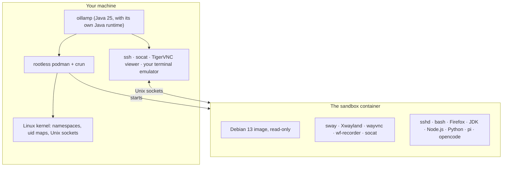

# The tech stack

oillamp is a small Java program that puts together a lot of existing Linux tools. This document
introduces those tools, one at a time, for a programmer who has not worked with them before.

You are probably comfortable with a terminal, Git and a JVM language, and you have probably used
Docker to run a database for a test suite. You do not need to know what a user namespace or a
compositor is. Each term is explained the first time it appears.

Each section has the same two parts: **what the tool is**, in general, and **how oillamp uses
it**. How the pieces work together at run time is in [ARCHITECTURE.md](ARCHITECTURE.md).

---

## The stack at a glance



| Layer | Tools | What they do for oillamp |
|---|---|---|
| Isolation | Linux namespaces, user namespaces, capabilities | Make the sandbox a separate world that shares your kernel. |
| Container engine | podman (rootless), crun, slirp4netns | Build the image and start the container without any root service. |
| The image | Debian 13, a Containerfile | The sandbox's frozen filesystem, with every tool the agent needs. |
| Connections | Unix domain sockets, socat | Every connection between your machine and the sandbox. |
| Shell | OpenSSH | Your terminal window and the agent's login. |
| Desktop | Wayland, sway, Xwayland | A graphical desktop that exists only in memory. |
| Watching | VNC, wayvnc, TigerVNC | Shows that desktop in a window on yours. |
| Desktop helpers | grim, wtype, wf-recorder | Screenshots, keyboard input, screen recording. |
| Network | an HTTP proxy (written in oillamp) | The sandbox's only way to the internet. |
| Agent tools | SDKMAN, npm, pi, opencode, Eden AI | The toolchains and AI harnesses in the sandbox. |
| oillamp itself | Java 25, Gradle, Jackson, Sprouts, Error Prone, NullAway, jlink | The program you run. |
| oillamp's tests | Groovy, Spock, ArchUnit | Checks of what users experience, and of the code's shape. |

---

## Containers and namespaces

### What they are

A **virtual machine** simulates a whole computer, with its own kernel. It is strongly isolated,
but it takes tens of seconds to start and uses a lot of memory before anything useful happens.

A **container** is different. There is only one kernel: yours. A process in a container is an
ordinary process on your machine, and `ps` on your machine shows it. What makes it a container is
that the kernel gives it a different **view** of a few things:

- which files exist (it sees a different root directory),
- which other processes exist (only its own),
- which network interfaces exist,
- which user numbers mean what.

Each of these views is a kernel feature called a **namespace**. A container is simply a process
started with its own set of namespaces.

So containers start in milliseconds and cost almost nothing, but they are only as isolated as the
kernel keeps them. A kernel bug that can be reached from inside is a way out. A virtual machine
has a smaller attack surface; a container is far easier to use.

### How oillamp uses them

The sandbox is one container. It gets its own filesystem view (the image, plus a few directories
from the lamp), its own process list, and **no network interfaces except loopback**
(`--network=none`). The part that matters most for security is the user namespace, explained next.

---

## User namespaces, the uid map and subordinate ids

### What they are

On Linux, every file is owned by a number, and every process runs as a number. `/etc/passwd` maps
numbers to names for convenience, but the kernel only compares numbers. Your account is probably
1000 or 1001. These numbers are called **uids** (user ids); groups have **gids**.

A **user namespace** gives a process its own set of uids, plus a translation table to the real
ones. The table is the **uid map**. Inside, a process sees itself as one number; when it touches a
file, the kernel checks permissions with the translated number.

Where do the translated numbers come from? From `/etc/subuid`:

```
$ grep $USER /etc/subuid
you:165536:65536
```

This line says: *the user `you` may use the 65536 uids starting at 165536.* These are
**subordinate ids**: a block of numbers given to your account for containers. They belong to no
real user and own no file anywhere, unless one of your containers creates one. Most distributions
create this line along with your account.

### How oillamp uses them

oillamp starts the container with `--userns=keep-id:uid=1000,gid=1000`, which means *keep my
identity, but call me 1000 inside*. Every other container uid is taken in order from your
subordinate block. On a machine where your uid is 1001:

| Inside the container | Name inside | On your machine | What it can do to your machine |
|---|---|---|---|
| 0 | `root` | 165536 | Nothing. It owns no file on your system. |
| 1000 | `agent` | 1001 (**you**) | Everything you can do, to what it can see. |
| 1001 | `lamp` | 166536 | Nothing. It owns no file on your system. |

Three things follow:

- **"root" inside the container is not root.** It can install packages inside, but to your
  machine it is 165536, a number that owns nothing.
- **The agent is you, on purpose.** Files the agent writes in its home appear on your machine
  owned by you, so you can edit and commit them. The price is that the agent has your rights to
  anything it can see, which is why the container sees so little.
- **The infrastructure user `lamp` is a stranger to both of you.** It runs the desktop, the
  recorder and the network bridges. The agent cannot stop those processes or change the
  recording, and neither can your own account directly, which is why deleting a lamp needs
  `oillamp remove`.

You can check this yourself:

```sh
podman run --rm --userns=keep-id:uid=1000,gid=1000 --user 0:0 -v /tmp/out:/out \
    --entrypoint /bin/sh localhost/oillamp/sandbox:<tag> -c '
        touch /out/by-root
        setpriv --reuid=agent --regid=agent --init-groups -- touch /out/by-agent'
stat -c '%n  %u (%U)' /tmp/out/*
#   /tmp/out/by-agent   1001 (you)
#   /tmp/out/by-root  165536 (UNKNOWN)
```

If the `/etc/subuid` line is missing, rootless containers cannot work. oillamp then adds a free
range with `sudo usermod`, or prints the command.

---

## Capabilities and setuid

### What they are

Root's powers are split into about forty **capabilities**: "may change file ownership", "may
switch to another user", "may ignore file permissions", and so on. A process can hold some and
drop the rest, and a dropped capability cannot come back.

A **setuid** program is a file marked to run as its owner, whoever starts it. `sudo` works this
way. Inside a container, a setuid program is a way for one user to become another.

### How oillamp uses them

The container's first process starts as container root, because it needs a few capabilities to
create directories for each user and switch users. It starts every long-running process with
`setpriv`, which switches the user **and removes every capability**. So neither the agent nor
the infrastructure processes hold any. The image build also removes the setuid bit from every
file, so there is no way to switch users from inside.

---

## podman, rootless, crun and slirp4netns

### What they are

**podman** builds container images and runs containers. Its commands are almost the same as
Docker's (`podman build`, `podman run`, `podman ps`).

The difference that matters here: Docker is usually a background service running as root, and
asking it to start a container is close to asking it to run a command as root. **Rootless**
podman has no service at all. It runs as you, as an ordinary program, and the containers it
starts are your processes. If something escapes, it lands in your account, not root's.

podman hands the low-level work of creating a container to an **OCI runtime**. There are two
common ones, `runc` and **crun**. **slirp4netns** gives rootless containers network access; it
is used while building the image, not by the running sandbox.

`podman unshare <command>` runs a command inside your user namespace, where your account can act
as its subordinate ids.

### How oillamp uses them

- oillamp requires rootless podman and refuses to run any other way.
- It requires **crun**, because passing your graphics card into the container needs
  `--group-add keep-groups`, which only crun supports. Ubuntu 24.04 installs runc by default.
- It requires **slirp4netns**, because the image build downloads packages and rootless podman on
  Ubuntu 24.04 has no network backend without it.
- It uses `podman unshare chown` to hand directories to the infrastructure user, and
  `podman unshare rm` to delete them again.
- It asks podman for its facts (`podman info`, `podman container inspect`) rather than keeping
  its own records. Containers carry **labels** (`oillamp.agent-id`, `oillamp.lamp`) so oillamp
  can find them again.

oillamp installs missing packages (podman, crun, slirp4netns and a few others) with `apt-get` on
Debian and Ubuntu, after showing the list. `oillamp doctor` shows what is missing without
installing anything.

---

## Images, layers, bind mounts and tmpfs

### What they are

An **image** is a frozen filesystem plus a note saying which program to start. A **container** is
one running instance of an image, the way a process is a running instance of a program on disk.

An image is built from a recipe called a **Containerfile** (Docker calls it a Dockerfile). Each
instruction produces a **layer**, the changes it made. Layers are cached, so changing the last
instruction rebuilds only the last layer. Slow, rarely changed steps go first.

A **bind mount** (the `--volume` flag) attaches a directory from your machine into the container
at a chosen path. Whatever the image had at that path is hidden underneath while it is attached.

A **tmpfs** is a directory that lives in memory and disappears when the container stops.

`--read-only` makes the image's own filesystem unchangeable while the container runs.

### How oillamp uses them

- The image is built from `src/main/resources/image/Containerfile`, on **Debian 13 "trixie"**.
  Debian rather than Ubuntu because Ubuntu ships Firefox as a snap, and snaps do not work in
  containers.
- The image's tag is not a version number but a **fingerprint of every input**: the
  Containerfile, every file copied in, and the build arguments. If podman has an image with that
  tag, it is exactly right and the build is skipped. If anything changed, the tag changes and a
  new image is built. Nobody has to remember to rebuild.
- The container runs `--read-only`. The only writable places are a few bind mounts from the lamp
  and two tmpfs directories, `/run` and `/tmp`. So anything installed system-wide is gone at the
  end of a session, and anything in the agent's home stays.
- The agent's home, `/home/agent`, is a bind mount. That hides anything the image put there, so
  tools that normally install into the home (SDKMAN, pi's settings) are installed elsewhere in
  the image and copied into the home when a session starts.

---

## Unix domain sockets and socat

### What they are

A **socket** is a two-way channel between two running programs. A network socket is addressed by
an IP address and port, like `127.0.0.1:3128`. A **Unix domain socket** is addressed by a **file
path**, like `/run/user/1001/oillamp/v4elchzj/run/control.sock`, and works only between programs
that share a kernel.

The `.sock` file holds no data. It is a meeting point: a server creates it and listens, clients
connect to the path, and each gets its own private connection. `ls -l` shows it with an `s` in
front of its permissions. Three properties matter:

- **File permissions decide who may connect.** No password, no firewall.
- **A socket in a bind-mounted directory is visible on both sides**, so a program inside the
  container and one outside can talk without any network.
- **The file stays when its server dies.** "The file exists" never means "someone is listening";
  only a connection attempt tells you that.

Linux limits a socket path to **107 bytes**.

**socat** is a small tool that connects any two kinds of stream: a TCP port to a Unix socket,
standard input to a Unix socket, and so on. It is handy for trying things by hand:

```sh
echo '{"op":"status"}' | socat - UNIX-CONNECT:$XDG_RUNTIME_DIR/oillamp/<agent id>/run/control.sock
ss -xlp        # which Unix sockets are listening, and which process owns each
```

`$XDG_RUNTIME_DIR` is a per-user directory in memory, usually `/run/user/<your uid>`. It is
emptied at every reboot.

### How oillamp uses them

**Every** connection between your machine and the sandbox is a Unix socket. There is no TCP port
on your machine and no network interface in the container. Because lamp paths can be long, oillamp
reaches the sockets through a short directory under `$XDG_RUNTIME_DIR`. oillamp connects to each
socket before it says the sandbox is ready, rather than checking that the file exists. socat runs
on both sides: in the container it turns local TCP ports into Unix sockets, and on your machine it
carries your SSH connection.

---

## SSH

### What it is

**OpenSSH** gives you a shell on another machine: `ssh` is the client, `sshd` the server. Logins
use a **key pair** (a private key you keep, a public key the server lists in `authorized_keys`),
and the client checks the server's **host key** against `known_hosts`. An `ssh_config` file can
hold settings per host, and `ProxyCommand` tells ssh to reach a host through another program
instead of the network. `sshd -i` serves one connection on its standard input and output.

### How oillamp uses it

Each lamp has its own key pair and its own host key, created with `ssh-keygen`, and a ready-made
`ssh_config` and `known_hosts`. Your own SSH keys are never offered to the sandbox. The terminal
window runs `ssh` with a `ProxyCommand` that uses socat to reach a Unix socket. Inside, socat
starts one `sshd -i` per connection, as the `agent` user. Every kind of SSH forwarding is turned
off, so SSH cannot become a second way out that skips the network policy.

---

## Wayland, sway and Xwayland

### What they are

Linux has no graphics system built into the kernel. An ordinary program owns the screen, and
every application that wants to draw connects to it over a socket, sends it pictures, and gets
keyboard and mouse events back. That program is the **compositor**: it composes all the windows
into the one image on the screen.

**Wayland** is the protocol they speak; it is a specification, not a program. **sway** is a small
Wayland compositor. It can run **headless**: instead of driving a monitor it creates a screen that
exists only in memory, which applications see as an ordinary display.

The older protocol is **X11**. Many applications, **Java Swing** among them, still draw through
it. **Xwayland** is an X11 server that runs as a Wayland client, so X11 applications appear as
ordinary windows.

### How oillamp uses them

sway runs headless inside the container, as the infrastructure user, with one virtual screen
called `HEADLESS-1` (1920 × 1080 by default). It starts Xwayland on display `:0` and keeps it
running. The agent's programs connect to sway's display socket like any application, but not to
sway's **control socket**, which could run commands. sway's configuration has no key binding that
runs a command, because the agent can type into the desktop.

sway draws either with your graphics card (the `gles2` renderer) or with the processor (the
`pixman` renderer, slower but always works).

---

## VNC: wayvnc and TigerVNC

### What they are

**VNC** is an old, simple protocol for sending a remote screen as images and sending keyboard and
mouse input back. **wayvnc** is a VNC server for Wayland compositors like sway. **TigerVNC** is a
VNC client; its `vncviewer` program can connect to a Unix socket path directly.

### How oillamp uses them

wayvnc runs inside the container as the infrastructure user and serves the desktop on a Unix
socket in the lamp. Your viewer window is TigerVNC's `vncviewer`, pointed at that socket. By
default you can paste into the sandbox, but the sandbox cannot put things on your clipboard.

The agent's `lamp click` command uses the same socket: a small Python helper, `lamp-pointer`,
speaks just enough VNC to send mouse events at exact screen positions.

---

## Desktop helpers: grim, wtype and wf-recorder

### What they are

Small command-line tools for Wayland: **grim** takes screenshots, **wtype** types text and key
combinations, **wf-recorder** records the screen to a video file.

### How oillamp uses them

The agent drives the desktop through **`lamp`**, a short shell script in the sandbox that wraps
these tools (`lamp screenshot`, `lamp type`, `lamp key`, `lamp click`, `lamp wait-stable`). It is a
script on purpose, so the agent can read it and call the tools directly when it needs to.

If recording is switched on, wf-recorder runs as the infrastructure user and writes a Matroska
(`.mkv`) file into the lamp. The agent can watch the recording but cannot change or delete it.
Recording is **off** by default.

---

## HTTP proxies

### What they are

An **HTTP proxy** is a server that makes connections on a client's behalf. For plain HTTP the
client sends the whole URL (`GET http://host/path`). For HTTPS it sends `CONNECT host:443`, and
after the proxy answers `200`, the two sides simply copy encrypted bytes; the proxy never sees the
content. Most tools use a proxy when the environment variables `HTTP_PROXY` and `HTTPS_PROXY` are
set. Java reads `-Dhttps.proxyHost` and similar settings instead.

### How oillamp uses them

The sandbox has no network, so oillamp itself is its proxy. Every shell in the sandbox has the
proxy variables pointing at `127.0.0.1:3128`, where socat hands each connection to a Unix socket,
and oillamp on your machine answers it. oillamp resolves the host name, checks **each resolved
address** against the rules in `oillamp.toml`, and connects or answers `403` with the name of the
rule. This way a public name that points into your local network is refused because of where it
points. Outbound `git@github.com:` SSH goes through the same proxy. Tools that ignore proxy
settings and do their own DNS lookups get no network at all.

---

## The agent's tools: SDKMAN, npm, pi, opencode and Eden AI

### What they are

**SDKMAN** installs and switches between versions of JDKs, Gradle, Groovy, Maven and similar
tools (`sdk install java 21.0.12+1.1-tem`). **npm** is Node.js's package manager. **pi** and
**opencode** are AI coding harnesses: terminal programs that let a language model read, edit and
run code. **Eden AI** is a service that gives access to many language models through one API.

### How oillamp uses them

All of them are installed while the image is built, into `/usr/local/share/oillamp/`, and SDKMAN
and pi's settings are copied into the agent's home when a session starts. A failure to install any
of them never fails the image build; the sandbox is still useful without them.

Both harnesses reach Eden AI **only through its EU endpoint**, `https://api.eu.edenai.run/v3`. The
sandbox's shell environment sets it for pi, a configuration file written during the build sets it
for opencode, and a network rule refuses the global endpoint for anything else. Your
`EDENAI_API_KEY` is passed into the sandbox if it is set when you start oillamp.

---

## TOML

### What it is

**TOML** is a configuration file format: `key = value` lines, grouped under `[section]` headers,
with `[[section]]` for lists of tables. Unlike YAML, indentation means nothing, and it allows
comments.

### How oillamp uses it

A lamp's settings are in `oillamp.toml`; defaults for all lamps can go in
`~/.config/oillamp/config.toml`. The lamp file wins, key by key, but lists are **replaced**, not
merged. Unknown keys are errors, with a suggestion for the nearest known key.

---

## The Java side

oillamp is about 12,500 lines of Java in one package. These are the tools used to build and test
it.

### Java 25

oillamp uses only final Java 25 features. The ones you see everywhere:

- **Records** for data. They are immutable, and they check their values in the constructor, so an
  invalid value cannot exist.
- **Sealed interfaces** with record cases for alternatives, handled by `switch` statements with no
  `default` branch. Adding a case then fails to compile until every `switch` handles it.
- **Markdown doc comments** (`///`) instead of HTML Javadoc.
- **Virtual threads** for the many small socket connections.

### Gradle

The build tool. `./gradlew` downloads the right Gradle version itself; you only need a JDK 25. One
Gradle module holds everything.

### Error Prone and NullAway

**Error Prone** is a compiler plugin that reports common bug patterns. **NullAway**, run through
it, checks that nothing that might be `null` is used without a check. oillamp uses no `null` at
all; absence is `Optional`. NullAway failures stop the build.

### Jackson

A JSON library, with a module that reads TOML. oillamp uses it for every JSON file and message
(through one class, `Json`) and for reading `oillamp.toml`.

### Sprouts

A library of **persistent collections**: immutable lists, sets and maps where every "change"
returns a new collection and leaves the old one as it was. oillamp's records hold these
(`Tuple`, `ValueSet`, `Association`) instead of `java.util` collections.
[SproutsCheatSheet.md](SproutsCheatSheet.md) lists the methods you need.

### jlink and the single-file launcher

**jlink** builds a cut-down Java runtime containing only the modules a program needs. oillamp's
has four modules, which is why the finished program is about 40 MB rather than 300. The build
packs that runtime and oillamp's jars into an archive and puts a short shell script,
`src/packaging/launcher.sh`, in front of it. The result is one executable file that unpacks itself
into `~/.cache/oillamp/` on first run.

### Groovy, Spock and ArchUnit

The tests are written in **Groovy**, a JVM language, with **Spock**, a test framework whose tests
read like specifications. Each test describes a situation a user can be in; oillamp calls them
**scenarios**. **spock-reports** turns them into readable Markdown. **ArchUnit** checks the shape of
the code: which types are public, and which classes may touch files, processes or threads.
